# DATABASE_ARCHITECTURE.md

> Documento canónico del diseño de base de datos de vfinancy.
> **Estado:** Phase 1 — diseño completo. **Sin SQL todavía.**
> Todo objeto de base de datos que se cree en Phase 2+ debe estar justificado en este documento.

---

## Tabla de contenidos

1. [Visión general](#1-visión-general)
2. [Business Domain Model](#2-business-domain-model)
3. [Módulos del ERP](#3-módulos-del-erp)
4. [Estrategia transversal](#4-estrategia-transversal)
   - 4.1 Auditoría
   - 4.2 Soft Delete
   - 4.3 Multi-moneda
   - 4.4 Multi-empresa y multi-sucursal
   - 4.5 Inventario
   - 4.6 Financiero
   - 4.7 Impuestos
   - 4.8 Numeración de documentos
5. [Convenciones de nombrado](#5-convenciones-de-nombrado)
6. [Database Standards](#6-database-standards)
7. [Entity Catalog](#7-entity-catalog)
8. [Relationship Catalog](#8-relationship-catalog)
9. [ERD — Diagrama Entidad-Relación](#9-erd--diagrama-entidad-relación)
10. [Index Strategy](#10-index-strategy)
11. [Constraint Strategy](#11-constraint-strategy)
12. [Future Scalability](#12-future-scalability)
13. [Decisiones explícitas y trade-offs](#13-decisiones-explícitas-y-trade-offs)

---

## 1. Visión general

vfinancy es un ERP desktop para PyMEs peruanas con proyección multi-país. El modelo de datos está diseñado para:

- **Precisión financiera absoluta** — sin errores de redondeo.
- **Trazabilidad total** — cada movimiento, cada cambio, cada login.
- **Concurrencia segura** — ventas, compras e inventarios no pueden generar estados inconsistentes.
- **Escalabilidad modular** — agregar SUNAT, multi-empresa o BI no debe romper nada existente.
- **Auditoría perpetua** — el sistema contable debe poder reconstruir cualquier estado en cualquier punto del tiempo.

PostgreSQL 16+ como motor. UUIDs como PK. 3NF estricta en datos transaccionales; desnormalización selectiva solo en agregaciones (vistas materializadas / tablas de resumen).

---

## 2. Business Domain Model

### 2.1 Entidades y agregados

```
┌────────────────────────────────────────────────────────────────────────────┐
│  IDENTITY & ACCESS                                                         │
│  companies  branches  users  roles  permissions  user_roles              │
│  role_permissions  user_sessions  login_history                           │
└────────────────────────────────────────────────────────────────────────────┘
┌────────────────────────────────────────────────────────────────────────────┐
│  MASTER DATA                                                               │
│  customers  customer_contacts  customer_addresses                         │
│  suppliers  supplier_contacts  supplier_addresses                         │
│  product_categories  product_brands  units_of_measure                     │
│  products  product_images  product_barcodes  product_suppliers           │
│  price_lists  price_list_items                                             │
│  taxes  tax_rates  tax_categories                                          │
│  document_types  currencies  exchange_rates                               │
└────────────────────────────────────────────────────────────────────────────┘
┌────────────────────────────────────────────────────────────────────────────┐
│  INVENTORY                                                                 │
│  warehouses  inventory_batches  inventory_movements                        │
│  inventory_stock (resumen)  inventory_transfers  inventory_adjustments     │
└────────────────────────────────────────────────────────────────────────────┘
┌────────────────────────────────────────────────────────────────────────────┐
│  PURCHASING                                                                │
│  purchases  purchase_lines  supplier_payments                             │
│  supplier_payment_allocations  purchase_returns  purchase_return_lines    │
│  supplier_credits                                                           │
└────────────────────────────────────────────────────────────────────────────┘
┌────────────────────────────────────────────────────────────────────────────┐
│  SALES                                                                     │
│  sales  sale_lines  customer_payments                                      │
│  customer_payment_allocations  customer_advances                           │
│  customer_advance_applications  sales_returns  sale_return_lines          │
│  customer_credits                                                           │
└────────────────────────────────────────────────────────────────────────────┘
┌────────────────────────────────────────────────────────────────────────────┐
│  TREASURY                                                                  │
│  bank_accounts  bank_transactions  bank_reconciliations                    │
│  credit_cards  credit_card_transactions                                    │
│  cash_registers  cash_movements                                            │
└────────────────────────────────────────────────────────────────────────────┘
┌────────────────────────────────────────────────────────────────────────────┐
│  ACCOUNTING                                                                │
│  chart_of_accounts  fiscal_years  fiscal_periods                          │
│  journal_entries  journal_entry_lines  account_balances (resumen)         │
└────────────────────────────────────────────────────────────────────────────┘
┌────────────────────────────────────────────────────────────────────────────┐
│  CROSS-CUTTING                                                             │
│  attachments  notifications  notification_recipients                       │
│  audit_logs  document_sequences                                            │
└────────────────────────────────────────────────────────────────────────────┘
```

### 2.2 Workflows canónicos

#### 2.2.1 Venta completa (camino feliz)

```
[Cliente]  →  crea  →  [Sale]  →  consume  →  [InventoryMovement: sale_out]
                                ↓
                                ├─ genera  →  [SaleLine] × N
                                ├─ calcula  →  [Tax] (IGV por línea)
                                ├─ calcula  →  [margin, profit]
                                ├─ crea    →  [AccountReceivable] (deuda)
                                └─ crea    →  [JournalEntry] (crédito fiscal)
                                                  ↓
[Cliente paga] → [CustomerPayment] → [CustomerPaymentAllocation]
                                       ↓
                              [AccountReceivable.balance = 0]
                              [JournalEntry] (cobranza)
```

#### 2.2.2 Compra completa (camino feliz)

```
[Proveedor]  →  crea  →  [Purchase]  →  receive  →  [InventoryBatch]
                                              ↓
                                [InventoryMovement: purchase_in]
                                [InventoryStock: +qty, avg_cost recalculado]
                                              ↓
                                [AccountPayable] (deuda)
                                [JournalEntry] (crédito fiscal del proveedor)
                                                  ↓
[Empresa paga] → [SupplierPayment] → [SupplierPaymentAllocation]
                                         ↓
                              [AccountPayable.balance = 0]
                              [JournalEntry] (pago)
```

#### 2.2.3 Anticipo de cliente

```
[Cliente]  →  [CustomerAdvance]  →  descuenta en futuras ventas
                                  ↓
                       [CustomerAdvanceApplication]
                       (n:1 contra sale)
```

#### 2.2.4 Devolución de venta

```
[Sale]  →  [SalesReturn]  →  re-ingresa  →  [InventoryMovement: return_in]
                       ├─ genera  →  [CustomerCredit] (nota de crédito)
                       └─ genera  →  [JournalEntry] (reverso)
```

#### 2.2.5 Transferencia entre almacenes

```
[InventoryTransfer]
  ├─ línea 1:  [InventoryMovement: transfer_out] en warehouse A
  └─ línea 2:  [InventoryMovement: transfer_in]  en warehouse B
Ambos movimientos comparten `transfer_id`.
Operación atómica: BEGIN TRANSACTION + SELECT FOR UPDATE.
```

#### 2.2.6 Regla de remate (25 días)

```
[InventoryBatch]  →  arrival_date = D
                     max_sale_date = D + 25
                     Si hoy > max_sale_date y quantity > 0  →  is_clearance = TRUE
[Dashboard]  →  muestra items en remate (vista materializada o query directo)
```

#### 2.2.7 Ciclo contable

```
[Diario] → [JournalEntry]
            ├─ posted_at = NOW() (no se puede borrar; solo reversing entry)
            ├─ lines[] = N, donde SUM(debit) = SUM(credit) (constraint)
            └─ genera [AccountBalance] por (account_id, fiscal_period_id)
[Trial Balance] = SUM(debit) - SUM(credit) por cuenta en un período (debe ser 0)
[Income Statement] = ingresos - costos - gastos
[Balance Sheet] = activos = pasivos + patrimonio
[Cash Flow] = entradas - salidas por actividad (operativa, inversión, financiamiento)
```

#### 2.2.8 Cierre mensual

```
[FiscalPeriod]  →  status: 'open' → 'closing' → 'closed'
                   Cuando 'closed', no se permiten más journal_entries en ese período
                   (excepto reversing entries, que se asignan al período actual).
```

#### 2.2.9 Auditoría

```
Cualquier cambio en tablas marcadas como "audited"  →  [AuditLog]
  - user_id, table_name, record_id, action
  - old_value JSONB, new_value JSONB
  - occurred_at, ip_address, user_agent
Implementación: capa de aplicación (Go) — captura pre/post y serializa a JSONB.
```

### 2.3 Reglas de negocio de alto nivel

| #   | Regla                                                                                                |
|-----|------------------------------------------------------------------------------------------------------|
| R1  | El stock NUNCA se almacena en `products`. Se calcula como SUM de `inventory_movements`.              |
| R2  | Los `inventory_movements` son append-only. Una corrección = nuevo movimiento compensatorio.          |
| R3  | Todo documento fiscal (sale, purchase, credit note) tiene número único por empresa.                |
| R4  | Un `journal_entry` posted no se borra. Corrección = `reversing_entry` referenciado.                 |
| R5  | Multi-moneda: cada documento guarda su `currency_id` y `exchange_rate` snapshot en el momento.      |
| R6  | Los reportes se expresan en la `functional_currency` de la empresa.                                  |
| R7  | Un batch de inventario es remate cuando `today > max_sale_date AND quantity > 0`.                  |
| R8  | Una venta en estado `paid` no se puede editar — solo anular con `sales_returns`.                    |
| R9  | Un `user` no puede asignarse a un `role` que no esté activo.                                         |
| R10 | Toda FK importante lleva índice. Toda unicidad lógica lleva índice parcial `WHERE deleted_at IS NULL`. |
| R11 | Las contraseñas se hashean con Argon2id. **Nunca** se almacenan en plano. No se loguean.            |
| R12 | `tax_rates` están versionados: cada cambio de tasa crea una nueva fila con `effective_from`.        |
| R13 | El IGV se calcula por línea, no por documento. Permite mezclar líneas gravadas y exoneradas.        |
| R14 | Las transferencias de stock son 2 movimientos en la misma transacción.                              |
| R15 | El sistema soporta multi-empresa: toda tabla importante tiene `company_id`.                          |

---

## 3. Módulos del ERP

Cada módulo declara sus entidades, su propósito, sus decisiones de modelado y sus reglas.

### 3.1 Identity & Access (RBAC)

Entidades: `companies`, `branches`, `users`, `roles`, `permissions`, `user_roles`, `role_permissions`, `user_sessions`, `login_history`.

Propósito: aislamiento multi-tenant, autenticación, autorización granular.

Decisiones:
- `permissions` es una tabla de catálogo (no enum en código) para permitir agregar permisos sin migración.
- `user_roles` y `role_permissions` son junction tables con PK compuesta.
- `user_sessions` permite revocación activa; en logout se marca `revoked_at`.
- `login_history` audita cada intento (exitoso o fallido) con IP y user-agent.

### 3.2 Master Data

Entidades: `customers`, `suppliers`, `products`, `product_categories`, `product_brands`, `units_of_measure`, `taxes`, `currencies`, `price_lists`, `document_types`.

Propósito: datos de referencia compartidos por todos los módulos transaccionales.

Decisiones:
- `customers` y `suppliers` son **tablas separadas** (no son polimórficas en "terceros") porque tienen campos diferentes (cliente tiene `credit_limit`, proveedor no).
- `product_categories` permite jerarquía (1:n recursivo) para sub-categorías.
- `product_barcodes` separado de `products` porque un producto puede tener varios códigos.
- `product_suppliers` permite m:n con atributos (costo, lead time, mínimo de pedido) — clave para reposición.
- `price_lists` y `price_list_items` soportan múltiples listas de precios por segmento de cliente.

### 3.3 Inventory

Entidades: `warehouses`, `inventory_batches`, `inventory_movements`, `inventory_stock` (resumen), `inventory_transfers`, `inventory_adjustments`.

Propósito: control de stock por almacén y lote, con trazabilidad completa y regla de 25 días.

Decisiones:
- `inventory_movements` es **append-only**. Cada fila tiene `quantity` con signo (positivo = entrada, negativo = salida).
- `inventory_stock` es una **tabla resumen** mantenida por triggers o por código de aplicación; nunca se edita directamente.
- `inventory_batches` rastrea cada ingreso con `arrival_date`, `cost`, `max_sale_date` (= arrival + 25), `lot_number`, `expiry_date` (si aplica).
- `inventory_transfers` es un documento que agrupa 2 movimientos (out + in) entre almacenes.
- `inventory_adjustments` registra ajustes manuales por conteo físico, daño, etc.

### 3.4 Purchasing

Entidades: `purchases`, `purchase_lines`, `supplier_payments`, `supplier_payment_allocations`, `purchase_returns`, `purchase_return_lines`, `supplier_credits`.

Propósito: registrar compras, gestionar deudas con proveedores y conciliarlas con pagos.

Decisiones:
- Una compra puede estar en estados: `pending`, `received`, `paid`, `reconciled`, `cancelled`.
- `supplier_payments` y `purchase_lines` se vinculan vía `supplier_payment_allocations` (m:n) — un pago puede cubrir varias facturas, una factura puede tener varios pagos parciales.
- `supplier_credits` representa notas de crédito recibidas del proveedor (devoluciones nuestras que el proveedor reconoce).

### 3.5 Sales

Entidades: `sales`, `sale_lines`, `customer_payments`, `customer_payment_allocations`, `customer_advances`, `customer_advance_applications`, `sales_returns`, `sale_return_lines`, `customer_credits`.

Propósito: registrar ventas, gestionar cuentas por cobrar y aplicar pagos/anticipos.

Decisiones:
- Una venta almacena el snapshot de: `currency_id`, `exchange_rate`, `subtotal`, `tax_amount`, `discount_amount`, `total`, `cost_total`, `profit` (calculado en el momento).
- `customer_advances` es un pago adelantado (sin factura). `customer_advance_applications` lo aplica a facturas futuras.
- `customer_credits` es una nota de crédito que emitimos al cliente (por devoluciones o descuentos posteriores).
- `margin` y `profit` se calculan en el momento de la venta con el costo promedio del producto (`inventory_stock.average_cost`).

### 3.6 Treasury

Entidades: `bank_accounts`, `bank_transactions`, `bank_reconciliations`, `credit_cards`, `credit_card_transactions`, `cash_registers`, `cash_movements`.

Propósito: gestión de cuentas bancarias, tarjetas de crédito, cajas, conciliaciones y tipos de cambio.

Decisiones:
- `bank_transactions` registra cada movimiento (depósito, retiro, comisión, interés). El match con `journal_entries` o `customer_payments` se hace por referencia.
- `bank_reconciliations` es un proceso batch: snapshot del saldo bancario vs. saldo contable, marcando diferencias.
- `credit_cards` son cuentas de pasivo (representan deuda). `credit_card_transactions` son los consumos.
- `exchange_rates` se almacenan diariamente. Cada documento usa el snapshot del día.

### 3.7 Accounting

Entidades: `chart_of_accounts`, `fiscal_years`, `fiscal_periods`, `journal_entries`, `journal_entry_lines`, `account_balances`.

Propósito: partida doble, libros contables, estados financieros.

Decisiones:
- `chart_of_accounts` jerárquico por `code` (e.g. `1.1.01` = Activo > Corriente > Caja y Bancos).
- `journal_entry` posted es inmutable. Correcciones = nuevos `journal_entry` con `reverses_entry_id`.
- Constraint: `SUM(debit) = SUM(credit)` en `journal_entry_lines` por entry (validado en trigger o en código).
- `fiscal_periods` tiene estados `open`, `closing`, `closed`. Cerrado = no se permiten más entries (excepto reversing).
- `account_balances` es resumen por (account_id, fiscal_period_id) para acelerar reportes.

### 3.8 Notifications & Attachments

Entidades: `notifications`, `notification_recipients`, `attachments`.

Propósito: comunicación interna (alertas, stock bajo, pagos vencidos) y archivos adjuntos polimórficos.

Decisiones:
- `attachments` es polimórfica: `owner_type` enum + `owner_id`. Constraint CHECK limita los `owner_type` válidos.
- `notification_recipients` permite notificaciones masivas (m:n entre notification y user).

### 3.9 Audit

Entidad: `audit_logs`.

Propósito: log inmutable de toda mutación relevante. Cumplimiento fiscal y forense.

Decisiones:
- `audit_logs` se particiona por mes (RANGE partitioning) cuando el volumen crece.
- Escritura desde la capa de aplicación, no por triggers (más control sobre qué se audita).
- `old_value` y `new_value` son JSONB con el snapshot completo de la fila.

---

## 4. Estrategia transversal

### 4.1 Auditoría

**Dos niveles:**

1. **Columnas de auditoría embebidas** (en cada tabla importante): `created_at`, `updated_at`, `deleted_at`, `created_by`, `updated_by`.
2. **Tabla global `audit_logs`**: snapshot pre/post de cualquier mutación. Contiene `user_id`, `table_name`, `record_id`, `action` (INSERT/UPDATE/DELETE/LOGIN/LOGOUT/EXPORT/APPROVE/REJECT/CONCILIATE/CLOSE/PRINT), `old_value JSONB`, `new_value JSONB`, `changed_fields TEXT[]`, `ip_address INET`, `user_agent TEXT`, `occurred_at TIMESTAMPTZ`.

**Reglas:**

- Las columnas embebidas se mantienen por código (Go) o por trigger BEFORE UPDATE.
- `audit_logs` se escribe en la misma transacción que la mutación. Si la mutación falla, el log también.
- `audit_logs` es append-only. La única operación permitida es INSERT.
- Los snapshots JSONB no incluyen campos sensibles (`password_hash`, tokens).

### 4.2 Soft Delete

- Toda tabla importante tiene `deleted_at TIMESTAMPTZ NULL`.
- El "registro activo" es `WHERE deleted_at IS NULL`.
- Índices únicos sobre claves naturales son **parciales**: `WHERE deleted_at IS NULL`, para permitir reusar el `document_number` tras borrado lógico (excepto documentos fiscales: ver §4.8).
- Las FKs hacia tablas con soft delete NO cascadean el soft delete del padre.
- `hard_delete` es operación administrativa con doble confirmación y motivo obligatorio. Se loguea en `audit_logs` con `action='HARD_DELETE'`.

### 4.3 Multi-moneda

- `currencies` es una tabla lookup con código ISO 4217 (`code CHAR(3) PRIMARY KEY`), `symbol`, `name`, `decimal_places` (2 para PEN, 0 para CLP/JPY).
- `exchange_rates(from_currency_code, to_currency_code, effective_date)` con `rate NUMERIC(18,6)` y `source` (BCRP, manual, etc.).
- Cada documento monetario tiene:
  - `currency_code CHAR(3) NOT NULL` (FK a `currencies.code`)
  - `exchange_rate NUMERIC(18,6) NOT NULL` (snapshot del día)
  - Los montos se guardan en la moneda del documento.
  - Para reportes: `amount_in_functional_currency = amount * exchange_rate` (vía vista o calculo en la capa de reporte).
- La **moneda funcional** se define en `companies.functional_currency_code` (default PEN).
- Las cuentas del `chart_of_accounts` están en moneda funcional. La conversión se hace al registrar el entry.

### 4.4 Multi-empresa y multi-sucursal

- `companies` raíz; `branches` pertenece a `companies` (1:n).
- `users` pertenece a una `company` (1:1 obligatorio). Accesos cross-company vía roles especiales (future).
- Toda tabla importante de negocio tiene `company_id UUID NOT NULL` (FK a `companies`).
- Los índices compuestos **siempre** empiezan por `company_id` (para partición lógica de queries).
- Las constraints UNIQUE son por empresa, no globales: `UNIQUE (company_id, document_number)`.
- Los warehouses pertenecen a una `branch` (no directo a `company`) para modelar jerarquías geográficas.

### 4.5 Inventario

- `products` NO tiene columna `stock`. El stock es un valor derivado.
- `inventory_movements` es la fuente de verdad. Cada fila es inmutable.
- `inventory_movements.quantity NUMERIC(18,4)` con signo. Positivo = entrada, negativo = salida.
- `inventory_movements.unit_cost NUMERIC(18,4)` (costo en el momento, para valoración).
- `inventory_batches` agrupa movimientos de un mismo ingreso (mismo `arrival_date`, `lot_number`, `cost`). Soporta trazabilidad y regla de remate.
- `inventory_stock` es tabla resumen: `(product_id, warehouse_id, batch_id) → quantity, average_cost, last_movement_at`. Mantenida por triggers o por servicio. Recalculable en cualquier momento.
- **Costo promedio ponderado** (WAC): al recibir un nuevo batch, `inventory_stock.average_cost` se recalcula como `(stock_actual * costo_actual + cantidad_nueva * costo_nuevo) / (stock_actual + cantidad_nueva)`.
- **Regla 25 días**: `inventory_batches.max_sale_date` es una columna GENERATED ALWAYS AS `(arrival_date + INTERVAL '25 days') STORED` o computada por la aplicación. Una vista `v_clearance_stock` muestra batches con `today > max_sale_date AND quantity > 0`.
- **Concurrencia**: cualquier `SELECT ... FOR UPDATE` sobre `inventory_stock` antes de un movimiento garantiza que dos ventas concurrentes no sobre-vendan.

### 4.6 Financiero

- **Partida doble** estricta: cada `journal_entry` posted tiene `SUM(debit) = SUM(credit)` (constraint CHECK o validación de aplicación).
- Cada documento de venta/compra/pago genera **exactamente un** `journal_entry` (más sus reversas si se anula).
- Los IDs de cuenta contable están **normalizados** en `chart_of_accounts`. Los documentos referencian cuentas indirectamente vía la transacción de integración, no directamente.
- Los importes en `journal_entry_lines` están en **moneda funcional** de la empresa.
- El cierre mensual (`fiscal_periods.status = 'closed'`) bloquea nuevos entries (validado en código o trigger).

### 4.7 Impuestos

- `taxes` catálogo: `IGV` (18%), `ISR` (29.5%), `IVAP` (4%), `EXEMPT` (0%), `OTHER`.
- `tax_rates` versiona los porcentajes por país: `(tax_id, country_code, effective_from, effective_to, rate NUMERIC(7,4))`.
- Cada `sale_line` / `purchase_line` tiene `tax_id` y `tax_rate` (snapshot). Esto permite cambios retroactivos de tasa sin afectar líneas pasadas.
- `tax_inclusive` por documento: si TRUE, los importes en líneas son brutos; el tax se desglosa. Si FALSE, se suma al subtotal.
- Soporte multi-impuesto por línea (futuro): tabla `sale_line_taxes` (1:n) si se requiere mezclar varios impuestos sobre la misma base.

### 4.8 Numeración de documentos

- `document_sequences(company_id, document_type, prefix, current_number, padding, is_fiscal, is_active)`.
- Numeración atómica: al crear un documento se hace `UPDATE ... SET current_number = current_number + 1 RETURNING current_number` dentro de la transacción.
- Para documentos fiscales (ventas, compras, NC), la serie es restringida a `[A-Z0-9]{1,4}` y el correlativo de 4–8 dígitos (regla SUNAT).
- Una vez emitido un documento fiscal, su `number` es **inmutable** y **no se reusa** aunque se borre lógicamente (constraint UNIQUE en la tabla fiscal, sin parcial).

---

## 5. Convenciones de nombrado

| Elemento         | Convención                          | Ejemplo                          |
|------------------|--------------------------------------|----------------------------------|
| Tablas           | `snake_case`, **plural**             | `customers`, `inventory_movements` |
| Tablas junction  | `parent1_parent2` (orden alfabético) | `user_roles`, `product_suppliers` |
| Tablas de línea  | `<padre>_lines` o `<padre>_details` | `sale_lines`, `purchase_lines`  |
| Tablas de log    | `<concepto>_history` o `audit_*`    | `audit_logs`, `login_history`   |
| Columnas         | `snake_case`, **singular**           | `customer_id`, `created_at`     |
| PK               | `id UUID`                            | `id` (siempre)                   |
| FK               | `<tabla_referenciada_singular>_id`  | `customer_id`, `company_id`     |
| Timestamps       | `<verbo>_at TIMESTAMPTZ`            | `created_at`, `occurred_at`      |
| Flags booleanos  | `is_<adjetivo>` o `has_<sustantivo>` | `is_active`, `is_cleared`       |
| Enums            | `<concepto>` como `VARCHAR` o `TEXT` con CHECK | `status`, `movement_type` |
| Índices          | `idx_<tabla>_<columnas>`            | `idx_sales_company_customer`     |
| Constraints UQ   | `uq_<tabla>_<columnas>`              | `uq_products_company_sku`       |
| Constraints CK   | `ck_<tabla>_<regla>`                | `ck_journal_lines_balance`      |
| Foreign keys     | `fk_<tabla>_<tabla_ref>`            | `fk_sales_customer`              |
| Vistas           | `v_<concepto>`                       | `v_clearance_stock`             |
| Funciones        | `fn_<verbo>`                         | `fn_calc_exchange`              |

Reglas:
- **Plural consistente**: todas las tablas en plural (incluso lookup: `currencies`, `taxes`, `roles`).
- **English** exclusivamente. Sin eñes ni acentos.
- **No prefijos de módulo** (`cust_`, `inv_`). El contexto lo da la tabla.
- **Sin abreviaturas crípticas**: `unit_price` no `up`, `quantity` no `qty` (excepto en aliases de query).

---

## 6. Database Standards

### 6.1 Reglas generales

- **PostgreSQL 16+**.
- **3NF estricta** en tablas transaccionales. Desnormalización solo en vistas materializadas y tablas resumen (`inventory_stock`, `account_balances`).
- **Surrogate keys UUID v4** en toda PK. `gen_random_uuid()` (pgcrypto o nativo en PG 13+).
- **Soft delete** universal en entidades de negocio (columna `deleted_at TIMESTAMPTZ NULL`).
- **Foreign keys** explícitas con acción `ON DELETE` / `ON UPDATE` definida por tabla.
- **Indexes** en toda PK, toda FK, y toda columna usada en WHERE/ORDER BY frecuente.
- **Check constraints** para enums y reglas de negocio simples.
- **Unique constraints** con índices parciales cuando aplique (`WHERE deleted_at IS NULL`).
- **Audit fields** (`created_at`, `updated_at`, `deleted_at`, `created_by`, `updated_by`) en toda tabla importante.

### 6.2 Tipos de datos

| Concepto              | Tipo PostgreSQL                          | Notas                                       |
|-----------------------|--------------------------------------------|---------------------------------------------|
| PK                    | `UUID`                                    | `DEFAULT gen_random_uuid()`                  |
| Strings cortas        | `VARCHAR(n)` con `n` justificado           | `code CHAR(3)` para ISO 4217                 |
| Strings largas        | `TEXT`                                     | Sin límite artificial                        |
| Enteros               | `BIGINT` para IDs grandes; `INTEGER` para counts |                                       |
| Decimales monetarios   | `NUMERIC(18,2)`                           | **Nunca** `FLOAT`/`REAL`/`DOUBLE PRECISION` |
| Cantidades            | `NUMERIC(18,4)`                           | 4 decimales para soportar kg, m, L          |
| Porcentajes           | `NUMERIC(7,4)`                            | 0.1800 = 18%                                |
| Tasas de cambio       | `NUMERIC(18,6)`                           | 6 decimales                                 |
| Timestamps            | `TIMESTAMPTZ`                             | UTC en DB; conversión a local en la app     |
| Booleanos             | `BOOLEAN`                                 |                                             |
| JSON                  | `JSONB`                                   | Para `audit_logs.old_value/new_value`, `config` |
| Enums                 | `VARCHAR` con CHECK o `CREATE TYPE ... AS ENUM` | Prefiero VARCHAR + CHECK para extensibilidad |
| Archivos              | referencias en `attachments` (URL/path)    | No se guardan blobs en DB                    |
| Direcciones IP        | `INET`                                    |                                             |
| Rangos                | `NUMRANGE`, `DATERANGE`, `TSRANGE`        | Solo si hay queries de overlap              |

### 6.3 Auditoría

- Implementación mixta:
  - **Columnas embebidas** (created_at, etc.) mantenidas por trigger `BEFORE INSERT/UPDATE` o por código Go (preferimos código para evitar magic).
  - **`audit_logs`**: escritura desde código Go. Trigger opcional para tablas críticas (no recomendado en v1).
- `audit_logs` se inserta en la **misma transacción** que la mutación.

### 6.4 Concurrencia

- Toda operación que lea stock y luego modifique debe usar `SELECT ... FOR UPDATE` sobre `inventory_stock` (o sobre el `inventory_movement` a insertar para serializar).
- Patrón transaccional canónico (venta):
  ```sql
  BEGIN;
  -- 1. Lock de stock
  SELECT quantity FROM inventory_stock
   WHERE product_id = $1 AND warehouse_id = $2 FOR UPDATE;
  -- 2. Validar cantidad suficiente
  -- 3. Insertar movimientos (uno por línea)
  -- 4. Insertar venta
  -- 5. Insertar lineas
  -- 6. Insertar account_receivable
  -- 7. Insertar journal_entry
  -- 8. Insertar journal_entry_lines (debit/credit balanceados)
  COMMIT;
  ```
- Toda reversa (anulación) es un **nuevo evento**, no un delete.

### 6.5 Normalización

- 3NF en datos transaccionales: cada atributo depende de la PK, de la PK completa, y de nada más.
- Ejemplo: el `total` de una venta **no** se almacena — se calcula desde `sale_lines`. **Pero** `total` se almacena para performance e histórico; se documenta como `GENERATED ALWAYS AS ... STORED` o se mantiene por trigger/código.
- Decisión: `sale.total` se almacena y se valida por trigger que `total = SUM(sale_lines.line_total)`. El cálculo se hace en la app para nuevos registros; el trigger es la red de seguridad.

---

## 7. Entity Catalog

Cada tabla incluye: propósito, columnas clave, PK, FKs, índices principales, constraints, estrategia de auditoría, soft delete.

> **Convención del catálogo:** la lista de columnas es **orientativa** (las definitivas se confirman en Phase 2 al escribir SQL). Lo importante aquí es la estructura, las relaciones y las reglas.

### 7.1 Identity & Access

#### `companies`
- **Propósito:** raíz multi-tenant.
- **PK:** `id UUID`
- **Columnas clave:** `code VARCHAR(20) UNIQUE`, `legal_name VARCHAR(200)`, `trade_name VARCHAR(200)`, `tax_id VARCHAR(20)`, `functional_currency_code CHAR(3)`, `country_code CHAR(2)`, `timezone VARCHAR(50)`, `fiscal_year_start_month SMALLINT`, `is_active BOOLEAN`
- **Audit:** `created_at`, `updated_at`, `deleted_at`, `created_by`, `updated_by`
- **Índices:** UNIQUE en `code`, `tax_id`. INDEX en `is_active WHERE deleted_at IS NULL`.

#### `branches`
- **Propósito:** sucursales físicas de la empresa.
- **PK:** `id UUID`
- **FKs:** `company_id → companies(id) ON DELETE RESTRICT`
- **Columnas clave:** `code VARCHAR(20)`, `name VARCHAR(200)`, `address TEXT`, `phone VARCHAR(30)`, `email VARCHAR(200)`, `is_default BOOLEAN`, `is_active BOOLEAN`
- **Audit:** sí
- **Constraints:** UNIQUE (`company_id`, `code`) WHERE `deleted_at IS NULL`. Solo una `is_default=TRUE` por empresa (constraint parcial o validación de app).

#### `users`
- **Propósito:** cuentas de acceso al sistema.
- **PK:** `id UUID`
- **FKs:** `company_id → companies(id) ON DELETE RESTRICT`, `default_branch_id → branches(id) ON DELETE SET NULL`
- **Columnas clave:** `username VARCHAR(100) UNIQUE`, `email VARCHAR(200) UNIQUE`, `full_name VARCHAR(200)`, `password_hash TEXT`, `must_change_password BOOLEAN`, `failed_login_attempts INTEGER DEFAULT 0`, `locked_until TIMESTAMPTZ`, `last_login_at TIMESTAMPTZ`, `last_login_ip INET`, `is_active BOOLEAN`
- **Audit:** sí
- **Soft delete:** sí. `password_hash` nunca se loguea. Se almacena Argon2id con parámetros por empresa (`configurable en AuthConfig`).

#### `roles`
- **Propósito:** agrupación de permisos asignable a usuarios.
- **PK:** `id UUID`
- **FKs:** `company_id → companies(id) ON DELETE RESTRICT`
- **Columnas clave:** `code VARCHAR(50)`, `name VARCHAR(100)`, `description TEXT`, `is_system BOOLEAN` (no editable), `is_active BOOLEAN`
- **Audit:** sí
- **Constraints:** UNIQUE (`company_id`, `code`) WHERE `deleted_at IS NULL`. Seed inicial: `admin`, `manager`, `accountant`, `seller`, `warehouse`, `viewer` por empresa.

#### `permissions`
- **Propósito:** catálogo de permisos granulares (modulo.accion).
- **PK:** `code VARCHAR(100)` (string `module.action`, e.g. `customers.delete`).
- **Columnas clave:** `module VARCHAR(50)`, `action VARCHAR(50)`, `description TEXT`
- **Sin soft delete** (catálogo global, no por empresa).
- **Sin company_id** (los permisos son universales; la asignación al rol sí es por empresa).

#### `role_permissions`
- **Propósito:** junction m:n role × permission.
- **PK compuesta:** (`role_id`, `permission_code`)
- **FKs:** `role_id → roles(id) ON DELETE CASCADE`, `permission_code → permissions(code) ON DELETE CASCADE`
- **Audit:** sí (created_at, created_by).

#### `user_roles`
- **Propósito:** junction m:n user × role, con scope opcional.
- **PK compuesta:** (`user_id`, `role_id`, `scope_id` NULL)
- **FKs:** `user_id → users(id) ON DELETE CASCADE`, `role_id → roles(id) ON DELETE CASCADE`, `scope_id → branches(id) ON DELETE CASCADE` (NULL = toda la empresa)
- **Columnas clave:** `assigned_at TIMESTAMPTZ`, `assigned_by UUID → users(id)`, `expires_at TIMESTAMPTZ NULL` (opcional, para roles temporales).
- **Audit:** sí.

#### `user_sessions`
- **Propósito:** sesiones activas; permite revocación.
- **PK:** `id UUID`
- **FKs:** `user_id → users(id) ON DELETE CASCADE`
- **Columnas clave:** `token_hash TEXT UNIQUE`, `ip_address INET`, `user_agent TEXT`, `issued_at TIMESTAMPTZ`, `expires_at TIMESTAMPTZ`, `last_activity_at TIMESTAMPTZ`, `revoked_at TIMESTAMPTZ NULL`, `revoked_reason VARCHAR(200) NULL`
- **Sin soft delete** (las sesiones expiradas se purgan vía job).

#### `login_history`
- **Propósito:** auditoría de intentos de login.
- **PK:** `id UUID`
- **FKs:** `user_id → users(id) ON DELETE SET NULL` (puede haber intentos con username inexistente).
- **Columnas clave:** `username_attempted VARCHAR(100)`, `success BOOLEAN`, `failure_reason VARCHAR(100)`, `ip_address INET`, `user_agent TEXT`, `occurred_at TIMESTAMPTZ`.
- **Sin soft delete.** Tabla append-only.

### 7.2 Master Data

#### `customers`
- **Propósito:** clientes de la empresa.
- **PK:** `id UUID`
- **FKs:** `company_id → companies(id) ON DELETE RESTRICT`, `branch_id → branches(id) ON DELETE SET NULL` (cliente asignado a sucursal), `default_price_list_id → price_lists(id) ON DELETE SET NULL`.
- **Columnas clave:** `document_type VARCHAR(10)` (DNI, RUC, CE, PASSPORT), `document_number VARCHAR(20)`, `business_name VARCHAR(200)`, `trade_name VARCHAR(200)`, `tax_category_code VARCHAR(30)` (gravado, exonerado, inafecto), `credit_limit NUMERIC(18,2)`, `credit_used NUMERIC(18,2)` (calculado en cache), `payment_term_days SMALLINT`, `status VARCHAR(20)` (active, inactive, blocked), `blocked_reason TEXT`.
- **Audit:** sí. **Soft delete:** sí.
- **Constraints:** UNIQUE (`company_id`, `document_type`, `document_number`) WHERE `deleted_at IS NULL`. CHECK en `document_type` y `status`. CHECK en `credit_limit >= 0`.

#### `customer_contacts`
- **Propósito:** múltiples contactos por cliente.
- **PK:** `id UUID`
- **FKs:** `customer_id → customers(id) ON DELETE CASCADE`
- **Columnas clave:** `name VARCHAR(200)`, `role VARCHAR(100)` (compras, contabilidad, etc.), `email VARCHAR(200)`, `phone VARCHAR(30)`, `is_primary BOOLEAN`.

#### `customer_addresses`
- Similar a contacts, para múltiples direcciones de entrega o facturación.

#### `suppliers`
- **Propósito:** proveedores.
- **PK:** `id UUID`
- **FKs:** `company_id → companies(id) ON DELETE RESTRICT`
- **Columnas clave:** `document_number VARCHAR(20)`, `business_name VARCHAR(200)`, `is_international BOOLEAN`, `default_currency_code CHAR(3)`, `payment_term_days SMALLINT`, `status VARCHAR(20)`.
- **Constraints:** UNIQUE (`company_id`, `document_number`) WHERE `deleted_at IS NULL`.

#### `supplier_contacts`, `supplier_addresses`
- Análogos a clientes.

#### `product_categories`
- **Propósito:** jerarquía de categorías.
- **PK:** `id UUID`
- **FKs:** `company_id`, `parent_id → product_categories(id) ON DELETE RESTRICT`
- **Columnas clave:** `code VARCHAR(50)`, `name VARCHAR(200)`, `path TEXT` (path materializado: `1.2.5`), `depth SMALLINT`.
- **Constraints:** UNIQUE (`company_id`, `code`) WHERE `deleted_at IS NULL`. CHECK `depth <= 5`.

#### `product_brands`
- **Propósito:** marcas de productos.
- **PK:** `id UUID`
- **FKs:** `company_id`
- **Columnas clave:** `code VARCHAR(50)`, `name VARCHAR(200)`.
- **Constraints:** UNIQUE (`company_id`, `code`) WHERE `deleted_at IS NULL`.

#### `units_of_measure`
- **Propósito:** unidades (kg, L, und, m, pack).
- **PK:** `id UUID`
- **FKs:** `company_id`
- **Columnas clave:** `code VARCHAR(20)`, `name VARCHAR(100)`, `symbol VARCHAR(10)`, `allows_decimals BOOLEAN`.
- **Sin soft delete.** Catálogo semi-global.

#### `products`
- **Propósito:** productos / SKUs. **NO tiene columna `stock`.**
- **PK:** `id UUID`
- **FKs:** `company_id`, `category_id → product_categories(id) ON DELETE RESTRICT`, `brand_id → product_brands(id) ON DELETE SET NULL`, `unit_id → units_of_measure(id) ON DELETE RESTRICT`, `default_tax_id → taxes(id) ON DELETE RESTRICT`.
- **Columnas clave:** `sku VARCHAR(50)`, `barcode VARCHAR(50)` (principal; otros en `product_barcodes`), `description VARCHAR(500)`, `cost NUMERIC(18,4)` (costo estándar; el real es WAC en `inventory_stock`), `sale_price NUMERIC(18,2)`, `sale_price_currency_code CHAR(3)`, `min_stock NUMERIC(18,4)`, `max_stock NUMERIC(18,4)`, `is_active BOOLEAN`, `is_service BOOLEAN` (no controla stock), `weight NUMERIC(18,4)` (gramos).
- **Audit/Soft delete:** sí.
- **Constraints:** UNIQUE (`company_id`, `sku`) WHERE `deleted_at IS NULL`. UNIQUE (`company_id`, `barcode`) WHERE `deleted_at IS NULL AND barcode IS NOT NULL`. CHECK `cost >= 0`, `sale_price >= 0`, `min_stock >= 0`, `max_stock >= min_stock`.

#### `product_images`
- **PK:** `id UUID`
- **FKs:** `product_id`, `uploaded_by → users(id)`.
- **Columnas:** `url TEXT`, `sort_order SMALLINT`, `is_primary BOOLEAN`.

#### `product_barcodes`
- **PK:** `id UUID`
- **FKs:** `product_id`
- **Columnas:** `barcode VARCHAR(50)`, `quantity_per_unit NUMERIC(18,4) DEFAULT 1` (para packs).
- **Constraints:** UNIQUE (`barcode`) WHERE `deleted_at IS NULL`. **Global** (no por empresa) porque los códigos EAN son únicos en el mundo.

#### `product_suppliers`
- **Propósito:** m:n producto ↔ proveedor, con condiciones comerciales.
- **PK compuesta:** (`product_id`, `supplier_id`)
- **FKs:** `product_id`, `supplier_id`, `default_tax_id`
- **Columnas:** `supplier_sku VARCHAR(50)`, `cost NUMERIC(18,4)`, `currency_code CHAR(3)`, `lead_time_days SMALLINT`, `min_order_quantity NUMERIC(18,4)`, `is_preferred BOOLEAN`, `valid_from DATE`, `valid_to DATE NULL`.

#### `price_lists`
- **PK:** `id UUID`
- **FKs:** `company_id`, `currency_code`
- **Columnas:** `code VARCHAR(50)`, `name VARCHAR(200)`, `is_default BOOLEAN`, `valid_from DATE`, `valid_to DATE NULL`, `is_active BOOLEAN`.

#### `price_list_items`
- **PK compuesta:** (`price_list_id`, `product_id`)
- **FKs:** `price_list_id`, `product_id`
- **Columnas:** `price NUMERIC(18,2)`, `min_quantity NUMERIC(18,4) DEFAULT 1` (precios por volumen).

#### `taxes`
- **PK:** `id UUID`
- **Columnas:** `code VARCHAR(30) UNIQUE` (IGV, ISR, IVAP, EXEMPT, OTHER), `name VARCHAR(200)`, `short_name VARCHAR(50)`, `country_code CHAR(2)`, `is_inclusive BOOLEAN DEFAULT FALSE`, `is_percentage BOOLEAN DEFAULT TRUE`.
- **Sin company_id**: los tipos de impuesto son catálogo global. Las tasas sí son por país y se versionan.

#### `tax_rates`
- **Propósito:** versionar tasas por país y periodo.
- **PK:** `id UUID`
- **FKs:** `tax_id`
- **Columnas:** `country_code CHAR(2)`, `rate NUMERIC(7,4)`, `effective_from DATE`, `effective_to DATE NULL`, `is_active BOOLEAN`.
- **Constraints:** sin solapamiento: `EXCLUDE USING gist (tax_id WITH =, daterange(effective_from, effective_to) WITH &&)`. Requiere extensión `btree_gist`.

#### `tax_categories`
- **PK:** `code VARCHAR(30)` (gravado, exonerado, inafecto, exportacion).
- **Columnas:** `name VARCHAR(100)`, `description TEXT`.

#### `currencies`
- **PK:** `code CHAR(3)` (ISO 4217).
- **Columnas:** `symbol VARCHAR(5)`, `name VARCHAR(100)`, `decimal_places SMALLINT`, `is_active BOOLEAN`.
- **Sin company_id**. Catálogo global.

#### `exchange_rates`
- **PK:** `id UUID`
- **FKs:** `from_currency_code`, `to_currency_code`
- **Columnas:** `effective_date DATE`, `rate NUMERIC(18,6)`, `source VARCHAR(50)` (BCRP, manual, SUNAT, API), `is_official BOOLEAN`.
- **Constraints:** UNIQUE (`from_currency_code`, `to_currency_code`, `effective_date`).

#### `document_types`
- **PK:** `code VARCHAR(20)` (DNI, RUC, CE, PASSPORT, FACTURA, BOLETA, NC, ND, etc.)
- **Columnas:** `name VARCHAR(100)`, `category VARCHAR(30)` (identification, fiscal, internal), `country_code CHAR(2)`.

### 7.3 Inventory

#### `warehouses`
- **PK:** `id UUID`
- **FKs:** `company_id`, `branch_id`, `manager_user_id → users(id)`.
- **Columnas:** `code VARCHAR(20)`, `name VARCHAR(200)`, `address TEXT`, `is_default BOOLEAN`, `allows_clearance BOOLEAN DEFAULT TRUE`, `is_active BOOLEAN`.
- **Constraints:** UNIQUE (`company_id`, `code`) WHERE `deleted_at IS NULL`. Solo un `is_default=TRUE` por empresa.

#### `inventory_batches`
- **Propósito:** cada ingreso de producto a un almacén.
- **PK:** `id UUID`
- **FKs:** `company_id`, `product_id`, `warehouse_id`, `supplier_id NULL`, `purchase_line_id NULL` (trazabilidad a compra origen).
- **Columnas:** `lot_number VARCHAR(50)`, `serial_number VARCHAR(50) NULL` (para productos con serie), `arrival_date DATE`, `max_sale_date DATE` (GENERATED o computed = arrival + 25), `expiry_date DATE NULL` (no farmacéutico, pero se contempla), `initial_quantity NUMERIC(18,4)`, `current_quantity NUMERIC(18,4)`, `unit_cost NUMERIC(18,4)`, `currency_code CHAR(3)`, `status VARCHAR(20)` (active, depleted, written_off).
- **Audit/Soft delete:** sí.
- **Constraints:** CHECK `current_quantity >= 0`, `current_quantity <= initial_quantity`, `max_sale_date >= arrival_date`.

> Nota: `current_quantity` es un campo denormalizado (vive en `inventory_movements` también). Se mantiene por trigger o servicio. La fuente de verdad es `inventory_movements`.

#### `inventory_movements`
- **Propósito:** source of truth de stock. Append-only.
- **PK:** `id UUID`
- **FKs:** `company_id`, `product_id`, `warehouse_id`, `batch_id → inventory_batches(id) ON DELETE RESTRICT`, `currency_code`, `reference_type VARCHAR(30)`, `reference_id UUID` (polimórfico a sale, purchase, transfer, adjustment, manual).
- **Columnas:** `movement_type VARCHAR(20)` (purchase, sale, transfer_in, transfer_out, adjustment_in, adjustment_out, return_in, return_out, damage_out), `quantity NUMERIC(18,4)` (con signo), `unit_cost NUMERIC(18,4)`, `total_cost NUMERIC(18,4)`, `occurred_at TIMESTAMPTZ`, `notes TEXT`, `created_by → users(id)`.
- **Sin soft delete.** Append-only.
- **Constraints:** CHECK `quantity != 0`. CHECK `movement_type IN (...)`. CHECK `unit_cost >= 0`.
- **Índices críticos:** (`company_id`, `product_id`, `warehouse_id`, `occurred_at`), (`reference_type`, `reference_id`).

#### `inventory_stock` (tabla resumen)
- **Propósito:** estado actual del stock por (product, warehouse, batch).
- **PK compuesta:** (`warehouse_id`, `product_id`, `batch_id`).
- **FKs:** `company_id`, `product_id`, `warehouse_id`, `batch_id`, `currency_code`.
- **Columnas:** `quantity NUMERIC(18,4)`, `average_cost NUMERIC(18,4)`, `last_movement_at TIMESTAMPTZ`, `recalculated_at TIMESTAMPTZ`.
- **Recalculable** desde `inventory_movements`. Mantenida por trigger AFTER INSERT en movements o por servicio.
- **CHECK** `quantity >= 0`.

#### `inventory_transfers`
- **Propósito:** documento que agrupa 2 movimientos (out + in) entre almacenes.
- **PK:** `id UUID`
- **FKs:** `company_id`, `source_warehouse_id`, `destination_warehouse_id`, `requested_by`, `approved_by NULL`, `received_by NULL`.
- **Columnas:** `number VARCHAR(30)`, `transfer_date DATE`, `status VARCHAR(20)` (pending, in_transit, completed, cancelled), `notes TEXT`, `completed_at TIMESTAMPTZ NULL`.
- **Constraints:** CHECK `source_warehouse_id != destination_warehouse_id`.

#### `inventory_adjustments`
- **Propósito:** ajustes manuales (conteo físico, daño, merma).
- **PK:** `id UUID`
- **FKs:** `company_id`, `warehouse_id`, `product_id`, `batch_id NULL`, `approved_by NULL`.
- **Columnas:** `number VARCHAR(30)`, `adjustment_date DATE`, `reason VARCHAR(100)` (physical_count, damage, expiry, other), `quantity_delta NUMERIC(18,4)` (con signo), `notes TEXT`, `status VARCHAR(20)` (pending, approved, rejected).

### 7.4 Purchasing

#### `purchases`
- **PK:** `id UUID`
- **FKs:** `company_id`, `branch_id`, `supplier_id`, `currency_code`, `default_tax_id`, `created_by`, `approved_by NULL`, `cancelled_by NULL`, `journal_entry_id NULL` (entry contable generado).
- **Columnas:** `number VARCHAR(30)`, `document_type VARCHAR(20)` (factura, boleta, recibo, import), `document_series VARCHAR(10)`, `document_correlative VARCHAR(20)` (para fiscales), `supplier_document_number VARCHAR(30)`, `purchase_date DATE`, `due_date DATE`, `subtotal NUMERIC(18,2)`, `discount_amount NUMERIC(18,2)`, `tax_amount NUMERIC(18,2)`, `total NUMERIC(18,2)`, `exchange_rate NUMERIC(18,6)`, `total_in_functional_currency NUMERIC(18,2)`, `paid_amount NUMERIC(18,2)`, `balance NUMERIC(18,2)` GENERATED, `status VARCHAR(20)` (pending, received, paid, reconciled, cancelled), `notes TEXT`.
- **Constraints:** UNIQUE (`company_id`, `number`) (no parcial; documentos fiscales no se reusan). CHECK `status IN (...)`. CHECK `subtotal >= 0`, `total >= 0`.

#### `purchase_lines`
- **PK:** `id UUID`
- **FKs:** `purchase_id`, `product_id`, `tax_id`, `batch_id NULL`.
- **Columnas:** `line_number SMALLINT`, `quantity NUMERIC(18,4)`, `unit_price NUMERIC(18,4)`, `discount_percent NUMERIC(7,4)`, `discount_amount NUMERIC(18,2)`, `subtotal NUMERIC(18,2)`, `tax_rate NUMERIC(7,4)` (snapshot), `tax_amount NUMERIC(18,2)`, `line_total NUMERIC(18,2)`, `description_override VARCHAR(500) NULL`.
- **Constraints:** CHECK `quantity > 0`, `unit_price >= 0`.

#### `supplier_payments`
- **PK:** `id UUID`
- **FKs:** `company_id`, `supplier_id`, `currency_code`, `bank_account_id NULL`, `cash_register_id NULL`, `credit_card_id NULL`, `journal_entry_id NULL`, `created_by`, `approved_by NULL`.
- **Columnas:** `number VARCHAR(30)`, `payment_date DATE`, `amount NUMERIC(18,2)`, `exchange_rate NUMERIC(18,6)`, `amount_in_functional_currency NUMERIC(18,2)`, `payment_method VARCHAR(30)` (cash, bank_transfer, check, card, other), `reference VARCHAR(100)`, `status VARCHAR(20)` (pending, completed, rejected, reversed), `notes TEXT`.

#### `supplier_payment_allocations`
- **PK compuesta:** (`supplier_payment_id`, `purchase_id`)
- **FKs:** `supplier_payment_id`, `purchase_id`
- **Columnas:** `amount_applied NUMERIC(18,2)`, `applied_at TIMESTAMPTZ`, `applied_by → users(id)`.
- **Constraints:** CHECK `amount_applied > 0`. La suma de allocations por `supplier_payment_id` debe ser ≤ `amount`. La suma por `purchase_id` debe ser ≤ `purchase.total`. Validación en app + trigger.

#### `purchase_returns`
- **PK:** `id UUID`
- **FKs:** `company_id`, `supplier_id`, `purchase_id NULL` (puede ser sin compra origen), `currency_code`, `journal_entry_id NULL`.
- **Columnas:** `number VARCHAR(30)`, `document_series VARCHAR(10)`, `document_correlative VARCHAR(20)`, `return_date DATE`, `subtotal`, `tax_amount`, `total`, `exchange_rate`, `total_in_functional_currency`, `reason VARCHAR(200)`, `status`.

#### `purchase_return_lines`
- Similar a `purchase_lines` con FK a `purchase_return_id`.

#### `supplier_credits`
- **Propósito:** notas de crédito recibidas del proveedor.
- **PK:** `id UUID`
- **FKs:** `company_id`, `supplier_id`, `purchase_id NULL`, `purchase_return_id NULL`, `currency_code`, `journal_entry_id NULL`.
- **Columnas:** `number VARCHAR(30)`, `document_series`, `document_correlative`, `credit_date DATE`, `amount NUMERIC(18,2)`, `balance NUMERIC(18,2)` GENERATED, `exchange_rate`, `status`, `notes`.

### 7.5 Sales

#### `sales`
- **Estructura análoga a `purchases`**, con FKs a `customer_id`, `journal_entry_id`.
- **Columnas adicionales:** `cost_total NUMERIC(18,2)`, `profit NUMERIC(18,2)` GENERATED, `margin_percent NUMERIC(7,4)`, `due_date DATE`, `payment_term_days SMALLINT`, `price_list_id NULL`, `seller_user_id NULL`.
- **Estados:** `pending`, `partial`, `paid`, `cancelled`.

#### `sale_lines`
- Análoga a `purchase_lines`.

#### `customer_payments`
- Análoga a `supplier_payments`, con FK a `customer_id`.

#### `customer_payment_allocations`
- Análoga a `supplier_payment_allocations`.

#### `customer_advances`
- **PK:** `id UUID`
- **FKs:** `company_id`, `customer_id`, `currency_code`, `bank_account_id NULL`, `cash_register_id NULL`, `journal_entry_id NULL`, `created_by`.
- **Columnas:** `number`, `advance_date DATE`, `amount`, `exchange_rate`, `amount_in_functional_currency`, `applied_amount NUMERIC(18,2)` GENERATED, `balance NUMERIC(18,2)` GENERATED, `status`, `notes`.

#### `customer_advance_applications`
- **PK compuesta:** (`customer_advance_id`, `sale_id`)
- **FKs:** `customer_advance_id`, `sale_id`
- **Columnas:** `amount_applied NUMERIC(18,2)`, `applied_at`, `applied_by`.

#### `sales_returns`, `sale_return_lines`
- Análogas a purchase_returns.

#### `customer_credits`
- Análogas a supplier_credits, con FK a `customer_id`.

### 7.6 Treasury

#### `bank_accounts`
- **PK:** `id UUID`
- **FKs:** `company_id`, `branch_id`, `currency_code`, `gl_account_id → chart_of_accounts(id)`.
- **Columnas:** `bank_name VARCHAR(100)`, `account_number VARCHAR(50)`, `account_type VARCHAR(20)` (checking, savings), `current_balance NUMERIC(18,2)`, `is_active BOOLEAN`, `is_default BOOLEAN`.

#### `bank_transactions`
- **PK:** `id UUID`
- **FKs:** `bank_account_id`, `currency_code`, `reconciled_with_id → journal_entries(id) NULL` (entry que cuadró), `journal_entry_id NULL`.
- **Columnas:** `transaction_date DATE`, `value_date DATE`, `description TEXT`, `amount NUMERIC(18,2)` (con signo), `balance_after NUMERIC(18,2)`, `reference VARCHAR(100)`, `transaction_type VARCHAR(30)` (deposit, withdrawal, fee, interest, transfer, other), `is_reconciled BOOLEAN`, `reconciled_at TIMESTAMPTZ NULL`, `reconciled_by NULL`.
- **CHECK** `amount != 0`.

#### `bank_reconciliations`
- **PK:** `id UUID`
- **FKs:** `bank_account_id`, `created_by`, `closed_by NULL`.
- **Columnas:** `statement_date DATE`, `statement_balance NUMERIC(18,2)`, `book_balance NUMERIC(18,2)`, `difference NUMERIC(18,2)`, `status VARCHAR(20)` (open, closed), `closed_at TIMESTAMPTZ NULL`, `notes`.

#### `credit_cards`
- Análoga a bank_accounts pero tipo `credit_card`, con `credit_limit`, `current_balance` (deuda), `cut_off_day`, `payment_due_day`.

#### `credit_card_transactions`
- Análoga a bank_transactions.

#### `cash_registers`
- **PK:** `id UUID`
- **FKs:** `company_id`, `branch_id`, `warehouse_id NULL`, `responsible_user_id`, `gl_account_id`.
- **Columnas:** `code`, `name`, `current_balance NUMERIC(18,2)`, `is_active BOOLEAN`.

#### `cash_movements`
- Análoga a bank_transactions pero `cash_register_id`.

### 7.7 Accounting

#### `chart_of_accounts`
- **PK:** `id UUID`
- **FKs:** `company_id`, `parent_id → chart_of_accounts(id) ON DELETE RESTRICT`.
- **Columnas:** `code VARCHAR(30)`, `name VARCHAR(200)`, `account_type VARCHAR(20)` (asset, liability, equity, income, expense, contra_asset, contra_liability, contra_income, contra_expense, memo), `normal_balance VARCHAR(6)` (debit, credit), `is_active BOOLEAN`, `allows_movement BOOLEAN`, `description TEXT`, `path TEXT` (path materializado).
- **Constraints:** UNIQUE (`company_id`, `code`) WHERE `deleted_at IS NULL`. UNIQUE (`company_id`, `path`) WHERE `deleted_at IS NULL`.
- **Sin soft delete** (al menos en v1; podría agregarse). Las cuentas seed del sistema son `is_system = TRUE`.

#### `fiscal_years`
- **PK:** `id UUID`
- **FKs:** `company_id`
- **Columnas:** `year SMALLINT`, `start_date DATE`, `end_date DATE`, `status VARCHAR(20)` (open, closed), `closed_at TIMESTAMPTZ NULL`.
- **Constraints:** UNIQUE (`company_id`, `year`). CHECK `EXTRACT(YEAR FROM start_date) = year AND EXTRACT(YEAR FROM end_date) = year`. Sin solapamiento: `EXCLUDE USING gist (company_id WITH =, daterange(start_date, end_date) WITH &&)`.

#### `fiscal_periods`
- **PK:** `id UUID`
- **FKs:** `company_id`, `fiscal_year_id`
- **Columnas:** `period SMALLINT` (1–12), `start_date DATE`, `end_date DATE`, `status VARCHAR(20)` (open, closing, closed), `closed_at TIMESTAMPTZ NULL`, `closed_by NULL`.
- **Constraints:** UNIQUE (`fiscal_year_id`, `period`). Sin solapamiento. CHECK `status='open' → next_period_if_exists.status IN ('open', 'closing')` (no se cierra un periodo con el siguiente abierto).

#### `journal_entries`
- **PK:** `id UUID`
- **FKs:** `company_id`, `fiscal_period_id`, `currency_code`, `created_by`, `posted_by NULL`, `reverses_entry_id NULL`, `reversed_by_entry_id NULL`.
- **Columnas:** `number VARCHAR(30)`, `entry_date DATE`, `posting_date DATE NULL` (puede ser distinto a entry_date), `description TEXT`, `source VARCHAR(30)` (sale, purchase, payment, manual, adjustment, closing, opening), `source_id UUID NULL` (polimórfico), `status VARCHAR(20)` (draft, posted, reversed), `total_debit NUMERIC(18,2)` GENERATED, `total_credit NUMERIC(18,2)` GENERATED, `posted_at TIMESTAMPTZ NULL`, `notes TEXT`.
- **Constraints:** UNIQUE (`company_id`, `number`). CHECK `status='posted' → total_debit = total_credit` (vía trigger). Una vez posted, no se permite UPDATE ni DELETE (trigger).

#### `journal_entry_lines`
- **PK:** `id UUID`
- **FKs:** `journal_entry_id`, `account_id → chart_of_accounts(id)`, `cost_center_id NULL` (futuro), `currency_code`, `product_id NULL` (trazabilidad opcional).
- **Columnas:** `line_number SMALLINT`, `description TEXT`, `debit NUMERIC(18,2)`, `credit NUMERIC(18,2)`, `amount_in_transaction_currency NUMERIC(18,2) NULL`, `transaction_currency_code CHAR(3) NULL`, `exchange_rate NUMERIC(18,6) NULL`.
- **Constraints:** CHECK `(debit = 0 AND credit > 0) OR (debit > 0 AND credit = 0)`. CHECK `NOT (debit = 0 AND credit = 0)`. UNIQUE (`journal_entry_id`, `line_number`).

#### `account_balances` (resumen)
- **PK compuesta:** (`account_id`, `fiscal_period_id`)
- **FKs:** `account_id`, `fiscal_period_id`, `company_id`.
- **Columnas:** `opening_balance NUMERIC(18,2)`, `debit_total NUMERIC(18,2)`, `credit_total NUMERIC(18,2)`, `closing_balance NUMERIC(18,2)` GENERATED, `recalculated_at TIMESTAMPTZ`.

### 7.8 Cross-Cutting

#### `attachments`
- **PK:** `id UUID`
- **FKs:** `company_id`, `uploaded_by → users(id)`.
- **Columnas:** `owner_type VARCHAR(30)` (sale, purchase, customer, supplier, product, journal_entry, etc.), `owner_id UUID`, `file_name VARCHAR(255)`, `mime_type VARCHAR(100)`, `size_bytes BIGINT`, `storage_url TEXT`, `checksum VARCHAR(64)`, `is_private BOOLEAN`, `uploaded_at TIMESTAMPTZ`.
- **Constraints:** CHECK `owner_type IN (...)`. CHECK `size_bytes > 0`.
- **Índices:** (`owner_type`, `owner_id`), `company_id, uploaded_at`.

#### `notifications`
- **PK:** `id UUID`
- **FKs:** `company_id`, `created_by NULL`.
- **Columnas:** `title VARCHAR(200)`, `body TEXT`, `severity VARCHAR(20)` (info, warning, error, success), `category VARCHAR(30)` (stock_low, payment_due, clearance, system, etc.), `link_url TEXT NULL`, `published_at TIMESTAMPTZ`.

#### `notification_recipients`
- **PK compuesta:** (`notification_id`, `user_id`)
- **FKs:** `notification_id`, `user_id`.
- **Columnas:** `read_at TIMESTAMPTZ NULL`, `dismissed_at TIMESTAMPTZ NULL`.

#### `document_sequences`
- **PK:** `id UUID`
- **FKs:** `company_id`.
- **Columnas:** `document_type VARCHAR(30)`, `prefix VARCHAR(10)`, `current_number BIGINT`, `padding SMALLINT`, `is_fiscal BOOLEAN`, `is_active BOOLEAN`, `notes TEXT`.
- **Constraints:** UNIQUE (`company_id`, `document_type`).

#### `audit_logs`
- **PK:** `id UUID` (pero idealmente particionada por mes; PK compuesta con `occurred_at` para particiones).
- **Columnas:** `company_id`, `user_id NULL`, `table_name VARCHAR(100)`, `record_id UUID`, `action VARCHAR(30)`, `old_value JSONB NULL`, `new_value JSONB NULL`, `changed_fields TEXT[] NULL`, `ip_address INET NULL`, `user_agent TEXT NULL`, `device VARCHAR(200) NULL`, `occurred_at TIMESTAMPTZ DEFAULT NOW()`.
- **Constraints:** CHECK `action IN (...)`. Sin soft delete. Append-only.
- **Particionada por RANGE (`occurred_at`)** mensual cuando el volumen lo justifique.
- **Índices:** (`company_id`, `occurred_at DESC`), (`table_name`, `record_id`), (`user_id`, `occurred_at DESC`).

---

## 8. Relationship Catalog

Cardinalidades y acciones referenciales explícitas. `ON DELETE RESTRICT` es el default conservador para no perder historia. Solo se usa `CASCADE` cuando la fila hija no tiene sentido sin el padre (líneas de un documento, contactos de un cliente, etc.).

### 8.1 Identidad
- `companies 1 — n branches` (ON DELETE RESTRICT)
- `companies 1 — n users` (ON DELETE RESTRICT)
- `companies 1 — n roles` (ON DELETE RESTRICT)
- `companies 1 — n permissions` (NO; permissions es global)
- `branches 1 — n users` (default_branch_id) (ON DELETE SET NULL)
- `roles n — m permissions` vía `role_permissions` (ON DELETE CASCADE ambos)
- `users n — m roles` vía `user_roles` (ON DELETE CASCADE ambos lados)
- `users 1 — n user_sessions` (ON DELETE CASCADE)
- `users 1 — n login_history` (ON DELETE SET NULL)
- `roles 1 — n user_roles` (ON DELETE CASCADE)

### 8.2 Master Data
- `companies 1 — n customers` (ON DELETE RESTRICT)
- `customers 1 — n customer_contacts` (ON DELETE CASCADE)
- `customers 1 — n customer_addresses` (ON DELETE CASCADE)
- `branches 1 — n customers` (ON DELETE SET NULL)
- `price_lists 1 — n customers` (default_price_list_id) (ON DELETE SET NULL)
- `price_lists 1 — n price_list_items` (ON DELETE CASCADE)
- `products 1 — n price_list_items` (ON DELETE RESTRICT)
- `companies 1 — n suppliers` (ON DELETE RESTRICT)
- `suppliers 1 — n supplier_contacts` (ON DELETE CASCADE)
- `suppliers 1 — n supplier_addresses` (ON DELETE CASCADE)
- `companies 1 — n product_categories` (ON DELETE RESTRICT)
- `product_categories 1 — n product_categories` (parent_id, ON DELETE RESTRICT)
- `companies 1 — n product_brands` (ON DELETE RESTRICT)
- `companies 1 — n units_of_measure` (ON DELETE RESTRICT)
- `product_categories 1 — n products` (ON DELETE RESTRICT)
- `product_brands 1 — n products` (ON DELETE SET NULL)
- `units_of_measure 1 — n products` (ON DELETE RESTRICT)
- `taxes 1 — n products` (default_tax_id) (ON DELETE RESTRICT)
- `products 1 — n product_images` (ON DELETE CASCADE)
- `products 1 — n product_barcodes` (ON DELETE CASCADE)
- `products n — m suppliers` vía `product_suppliers` (ON DELETE CASCADE ambos)
- `taxes 1 — n tax_rates` (ON DELETE CASCADE)
- `taxes 1 — n products` (default_tax_id)
- `taxes 1 — n sale_lines` / `purchase_lines` (ON DELETE RESTRICT)

### 8.3 Inventory
- `companies 1 — n warehouses` (ON DELETE RESTRICT)
- `branches 1 — n warehouses` (ON DELETE RESTRICT)
- `warehouses 1 — n inventory_movements` (ON DELETE RESTRICT)
- `products 1 — n inventory_movements` (ON DELETE RESTRICT)
- `inventory_batches 1 — n inventory_movements` (ON DELETE RESTRICT)
- `products 1 — n inventory_batches` (ON DELETE RESTRICT)
- `warehouses 1 — n inventory_batches` (ON DELETE RESTRICT)
- `inventory_movements 1 — 1 inventory_stock` (PK compuesta, no FK separada)
- `inventory_transfers 1 — n inventory_movements` (transfer_id, referencia polimórfica)
- `suppliers 1 — n inventory_batches` (ON DELETE SET NULL)
- `purchase_lines 1 — n inventory_batches` (ON DELETE SET NULL)
- `products 1 — n inventory_adjustments` (ON DELETE RESTRICT)
- `warehouses 1 — n inventory_adjustments` (ON DELETE RESTRICT)
- `inventory_batches 1 — n inventory_adjustments` (ON DELETE SET NULL)

### 8.4 Purchasing
- `companies 1 — n purchases` (ON DELETE RESTRICT)
- `suppliers 1 — n purchases` (ON DELETE RESTRICT)
- `branches 1 — n purchases` (ON DELETE SET NULL)
- `purchases 1 — n purchase_lines` (ON DELETE CASCADE)
- `products 1 — n purchase_lines` (ON DELETE RESTRICT)
- `taxes 1 — n purchase_lines` (ON DELETE RESTRICT)
- `purchases 1 — n supplier_payment_allocations` (ON DELETE CASCADE)
- `supplier_payments 1 — n supplier_payment_allocations` (ON DELETE CASCADE)
- `suppliers 1 — n supplier_payments` (ON DELETE RESTRICT)
- `bank_accounts 1 — n supplier_payments` (ON DELETE SET NULL)
- `cash_registers 1 — n supplier_payments` (ON DELETE SET NULL)
- `credit_cards 1 — n supplier_payments` (ON DELETE SET NULL)
- `purchases 1 — n supplier_credits` (ON DELETE SET NULL)
- `purchase_returns 1 — n purchase_return_lines` (ON DELETE CASCADE)
- `purchases 1 — n purchase_returns` (ON DELETE SET NULL)
- `journal_entries 1 — n purchases` (ON DELETE SET NULL) — entry generado

### 8.5 Sales
- Mismo patrón que Purchasing, con:
- `customers 1 — n sales` (ON DELETE RESTRICT)
- `sales 1 — n sale_lines` (ON DELETE CASCADE)
- `sales 1 — n customer_payment_allocations` (ON DELETE CASCADE)
- `customer_payments 1 — n customer_payment_allocations` (ON DELETE CASCADE)
- `customers 1 — n customer_payments` (ON DELETE RESTRICT)
- `customers 1 — n customer_advances` (ON DELETE RESTRICT)
- `customer_advances 1 — n customer_advance_applications` (ON DELETE CASCADE)
- `sales 1 — n customer_advance_applications` (ON DELETE CASCADE)
- `sales 1 — n sales_returns` (ON DELETE SET NULL)
- `sales 1 — n customer_credits` (ON DELETE SET NULL)
- `price_lists 1 — n sales` (ON DELETE SET NULL)
- `users 1 — n sales` (seller_user_id) (ON DELETE SET NULL)

### 8.6 Treasury
- `companies 1 — n bank_accounts` (ON DELETE RESTRICT)
- `bank_accounts 1 — n bank_transactions` (ON DELETE RESTRICT)
- `bank_accounts 1 — n bank_reconciliations` (ON DELETE RESTRICT)
- `chart_of_accounts 1 — n bank_accounts` (gl_account_id) (ON DELETE RESTRICT)
- `currencies 1 — n bank_accounts` (currency_code) (ON DELETE RESTRICT)
- `companies 1 — n credit_cards` (ON DELETE RESTRICT)
- `credit_cards 1 — n credit_card_transactions` (ON DELETE RESTRICT)
- `companies 1 — n cash_registers` (ON DELETE RESTRICT)
- `cash_registers 1 — n cash_movements` (ON DELETE RESTRICT)
- `users 1 — n cash_movements` (responsible_user_id) (ON DELETE SET NULL)
- `journal_entries 1 — n bank_transactions` (ON DELETE SET NULL)

### 8.7 Accounting
- `companies 1 — n chart_of_accounts` (ON DELETE RESTRICT)
- `chart_of_accounts 1 — n chart_of_accounts` (parent_id, ON DELETE RESTRICT)
- `companies 1 — n fiscal_years` (ON DELETE RESTRICT)
- `fiscal_years 1 — n fiscal_periods` (ON DELETE RESTRICT)
- `companies 1 — n journal_entries` (ON DELETE RESTRICT)
- `fiscal_periods 1 — n journal_entries` (ON DELETE RESTRICT)
- `journal_entries 1 — n journal_entry_lines` (ON DELETE CASCADE)
- `chart_of_accounts 1 — n journal_entry_lines` (ON DELETE RESTRICT)
- `journal_entries 1 — 1 journal_entries` (reverses_entry_id, ON DELETE SET NULL, ambos lados)

### 8.8 Cross-Cutting
- `companies 1 — n attachments` (ON DELETE RESTRICT)
- `companies 1 — n notifications` (ON DELETE RESTRICT)
- `notifications 1 — n notification_recipients` (ON DELETE CASCADE)
- `users 1 — n notification_recipients` (ON DELETE CASCADE)
- `companies 1 — n document_sequences` (ON DELETE RESTRICT)
- `companies 1 — n audit_logs` (ON DELETE RESTRICT)
- `users 1 — n audit_logs` (ON DELETE SET NULL)

---

## 9. ERD — Diagrama Entidad-Relación

El siguiente diagrama está en formato Mermaid `erDiagram`. Es la representación textual del modelo. Para visualizarlo: copiar en un editor compatible ([mermaid.live](https://mermaid.live), GitHub markdown, VSCode con extensión Mermaid).

```mermaid
erDiagram
    companies ||--o{ branches : "tiene"
    companies ||--o{ users : "emplea"
    companies ||--o{ roles : "define"
    branches ||--o{ users : "asigna_default"
    branches ||--o{ warehouses : "ubica"
    branches ||--o{ bank_accounts : "posee"
    branches ||--o{ cash_registers : "opera"

    roles ||--o{ user_roles : "asignado_a"
    users ||--o{ user_roles : "tiene"
    user_roles }o--|| branches : "scope"
    roles ||--o{ role_permissions : "concede"
    permissions ||--o{ role_permissions : "asignado_a"

    users ||--o{ user_sessions : "inicia"
    users ||--o{ login_history : "intenta"
    users ||--o{ audit_logs : "realiza"
    users ||--o{ notifications : "crea"

    companies ||--o{ customers : "pertenece"
    branches ||--o{ customers : "asigna"
    price_lists ||--o{ customers : "default"
    customers ||--o{ customer_contacts : "tiene"
    customers ||--o{ customer_addresses : "tiene"
    customers ||--o{ sales : "compra"
    customers ||--o{ customer_payments : "paga"
    customers ||--o{ customer_advances : "anticipa"
    customers ||--o{ customer_credits : "tiene"

    companies ||--o{ suppliers : "pertenece"
    suppliers ||--o{ supplier_contacts : "tiene"
    suppliers ||--o{ supplier_addresses : "tiene"
    suppliers ||--o{ purchases : "vende"
    suppliers ||--o{ supplier_payments : "recibe"
    suppliers ||--o{ supplier_credits : "emite"
    suppliers ||--o{ product_suppliers : "abastece"
    suppliers ||--o{ inventory_batches : "origen"

    product_categories ||--o{ product_categories : "parent"
    product_categories ||--o{ products : "clasifica"
    product_brands ||--o{ products : "marca"
    units_of_measure ||--o{ products : "mide"
    taxes ||--o{ products : "default_tax"
    taxes ||--o{ tax_rates : "versiona"
    companies ||--o{ product_categories : "configura"
    companies ||--o{ product_brands : "configura"
    companies ||--o{ price_lists : "configura"
    companies ||--o{ warehouses : "configura"

    products ||--o{ product_images : "tiene"
    products ||--o{ product_barcodes : "tiene"
    products ||--o{ product_suppliers : "provisto_por"
    price_lists ||--o{ price_list_items : "contiene"
    products ||--o{ price_list_items : "lista_en"

    warehouses ||--o{ inventory_batches : "almacena"
    products ||--o{ inventory_batches : "lote_de"
    inventory_batches ||--o{ inventory_movements : "descompone"
    products ||--o{ inventory_movements : "movimiento_de"
    warehouses ||--o{ inventory_movements : "en"
    purchase_lines ||--o{ inventory_batches : "origen"

    purchases ||--|{ purchase_lines : "compuesta_de"
    products ||--o{ purchase_lines : "comprado"
    taxes ||--o{ purchase_lines : "gravado_con"
    suppliers ||--o{ purchases : "facturado_por"
    branches ||--o{ purchases : "recibido_en"
    journal_entries ||--o{ purchases : "contabiliza"

    supplier_payments ||--o{ supplier_payment_allocations : "asigna"
    purchases ||--o{ supplier_payment_allocations : "pagada_por"
    bank_accounts ||--o{ supplier_payments : "origen"
    cash_registers ||--o{ supplier_payments : "origen"
    credit_cards ||--o{ supplier_payments : "origen"
    journal_entries ||--o{ supplier_payments : "contabiliza"

    purchase_returns ||--|{ purchase_return_lines : "compuesta_de"
    purchases ||--o{ purchase_returns : "origen"
    suppliers ||--o{ purchase_returns : "procesado_por"
    purchases ||--o{ supplier_credits : "origina"
    purchase_returns ||--o{ supplier_credits : "origina"

    sales ||--|{ sale_lines : "compuesta_de"
    products ||--o{ sale_lines : "vendido"
    taxes ||--o{ sale_lines : "gravado_con"
    customers ||--o{ sales : "facturado_a"
    branches ||--o{ sales : "emitida_en"
    price_lists ||--o{ sales : "aplicada"
    users ||--o{ sales : "vendido_por"
    journal_entries ||--o{ sales : "contabiliza"

    customer_payments ||--o{ customer_payment_allocations : "asigna"
    sales ||--o{ customer_payment_allocations : "pagada_por"
    bank_accounts ||--o{ customer_payments : "destino"
    cash_registers ||--o{ customer_payments : "destino"
    journal_entries ||--o{ customer_payments : "contabiliza"

    customer_advances ||--o{ customer_advance_applications : "aplicado_en"
    sales ||--o{ customer_advance_applications : "descuenta"
    customers ||--o{ customer_advances : "pertenece"

    sales ||--o{ sales_returns : "origen"
    sales_returns ||--|{ sale_return_lines : "compuesta_de"
    customers ||--o{ sales_returns : "solicitada_por"
    sales ||--o{ customer_credits : "origina"
    sales_returns ||--o{ customer_credits : "origina"

    bank_accounts ||--o{ bank_transactions : "registra"
    bank_accounts ||--o{ bank_reconciliations : "concilia"
    chart_of_accounts ||--o{ bank_accounts : "asociada"
    chart_of_accounts ||--o{ cash_registers : "asociada"
    currencies ||--o{ bank_accounts : "moneda"
    currencies ||--o{ credit_cards : "moneda"
    currencies ||--o{ cash_registers : "moneda"

    credit_cards ||--o{ credit_card_transactions : "registra"
    cash_registers ||--o{ cash_movements : "registra"
    users ||--o{ cash_registers : "responsable"

    chart_of_accounts ||--o{ chart_of_accounts : "parent"
    fiscal_years ||--o{ fiscal_periods : "divide"
    journal_entries ||--|{ journal_entry_lines : "compuesta_de"
    chart_of_accounts ||--o{ journal_entry_lines : "debita/acreita"
    journal_entries ||--o| journal_entries : "reverses"
    fiscal_periods ||--o{ journal_entries : "registrada_en"
    chart_of_accounts ||--o{ account_balances : "acumula"
    fiscal_periods ||--o{ account_balances : "acumula_en"

    companies ||--o{ document_sequences : "configura"
    companies ||--o{ attachments : "posee"
    companies ||--o{ audit_logs : "registra"
    companies ||--o{ notifications : "emite"
    notifications ||--o{ notification_recipients : "dirigida_a"
    users ||--o{ notification_recipients : "recibe"

    currencies ||--o{ exchange_rates : "from"
    currencies ||--o{ exchange_rates : "to"
    currencies ||--o{ purchases : "moneda"
    currencies ||--o{ sales : "moneda"
    currencies ||--o{ supplier_payments : "moneda"
    currencies ||--o{ customer_payments : "moneda"
    currencies ||--o{ customer_advances : "moneda"
    currencies ||--o{ inventory_batches : "moneda_costo"
    currencies ||--o{ journal_entries : "moneda"
    currencies ||--o{ products : "moneda_precio"
```



### 9.1 Notas del ERD

- **Polimorfismo** (`reference_type` + `reference_id` en `inventory_movements`, `attachments`): el diagrama muestra las FKs lógicas; en SQL son dos columnas sin FK formal. El CHECK sobre `reference_type` garantiza la coherencia.
- **Recursividad** (`chart_of_accounts.parent_id`, `product_categories.parent_id`): se modela con auto-relación 1:n. El campo `path TEXT` materializa la ruta para queries eficientes.
- **Junction tables** (`user_roles`, `role_permissions`, `product_suppliers`): aparecen como nodos propios con dos FKs a las entidades que unen.
- **Tablas resumen** (`inventory_stock`, `account_balances`): se mantienen en sincronía con la fuente de verdad (`inventory_movements`, `journal_entry_lines`) vía triggers o servicio.

---

## 10. Index Strategy

Índices definidos por tabla, con justificación. Convención: `idx_<tabla>_<columnas>`.

### 10.1 Identidad

| Tabla               | Índice                                                       | Razón                                            |
|---------------------|--------------------------------------------------------------|--------------------------------------------------|
| `users`             | `idx_users_company_username` UNIQUE (`company_id`, `username`) | Login rápido                                      |
| `users`             | `idx_users_company_email` UNIQUE (`company_id`, `email`)      | Login + recuperación                               |
| `user_sessions`     | UNIQUE (`token_hash`)                                       | Búsqueda de sesión                                |
| `user_sessions`     | `idx_user_sessions_user_active` (`user_id`) WHERE `revoked_at IS NULL AND expires_at > NOW()` | Sesiones activas de un usuario                |
| `login_history`     | `idx_login_history_user_time` (`user_id`, `occurred_at DESC`) | Auditoría de usuario                              |
| `login_history`     | `idx_login_history_ip_time` (`ip_address`, `occurred_at DESC`) | Detección de ataques                              |

### 10.2 Master Data

| Tabla             | Índice                                                | Razón                                       |
|-------------------|--------------------------------------------------------|---------------------------------------------|
| `customers`       | `uq_customers_doc` UNIQUE (`company_id`, `document_type`, `document_number`) WHERE `deleted_at IS NULL` | Búsqueda + unicidad lógica                |
| `customers`       | `idx_customers_company_name` (`company_id`, `business_name`) | Búsqueda y listados                         |
| `customers`       | `idx_customers_company_status` (`company_id`, `status`) WHERE `deleted_at IS NULL` | Filtros por estado                          |
| `suppliers`       | `uq_suppliers_doc` UNIQUE (`company_id`, `document_number`) WHERE `deleted_at IS NULL` | Unicidad                                    |
| `suppliers`       | `idx_suppliers_company_name` (`company_id`, `business_name`) | Búsqueda                                   |
| `products`        | `uq_products_company_sku` UNIQUE (`company_id`, `sku`) WHERE `deleted_at IS NULL` | Búsqueda primaria                          |
| `products`        | `idx_products_company_category` (`company_id`, `category_id`) WHERE `deleted_at IS NULL` | Filtros por categoría                       |
| `products`        | `idx_products_company_brand` (`company_id`, `brand_id`) WHERE `deleted_at IS NULL` | Filtros por marca                          |
| `product_barcodes`| `uq_product_barcodes` UNIQUE (`barcode`) WHERE `deleted_at IS NULL` | Escaneo de código de barras (global)       |
| `product_categories` | `uq_categories_company_code` UNIQUE (`company_id`, `code`) WHERE `deleted_at IS NULL` | Unicidad                                   |
| `product_categories` | `idx_categories_parent` (`parent_id`)               | Árbol de categorías                          |
| `tax_rates`       | EXCLUDE GIST (`tax_id` WITH =, `daterange(effective_from, effective_to)` WITH `&&`) | Sin solapamiento de vigencias               |
| `exchange_rates`  | `uq_exchange_rates` UNIQUE (`from_currency_code`, `to_currency_code`, `effective_date`) | Búsqueda por día                            |
| `exchange_rates`  | `idx_exchange_rates_to_date` (`to_currency_code`, `effective_date` DESC) | Tasa de hoy a PEN                          |

### 10.3 Inventory

| Tabla                  | Índice                                                  | Razón                                              |
|------------------------|---------------------------------------------------------|----------------------------------------------------|
| `warehouses`           | `uq_warehouses_company_code` UNIQUE (`company_id`, `code`) WHERE `deleted_at IS NULL` | Unicidad                                  |
| `inventory_batches`    | `idx_batches_product_warehouse` (`company_id`, `product_id`, `warehouse_id`) WHERE `current_quantity > 0` | Stock actual por producto/almacén             |
| `inventory_batches`    | `idx_batches_clearance` (`max_sale_date`) WHERE `current_quantity > 0` | Búsqueda de remate (regla 25 días)          |
| `inventory_batches`    | `idx_batches_lot` (`company_id`, `product_id`, `lot_number`) WHERE `lot_number IS NOT NULL` | Trazabilidad por lote                       |
| `inventory_movements`  | `idx_movements_product_time` (`company_id`, `product_id`, `warehouse_id`, `occurred_at` DESC) | Historial de stock y reportes                |
| `inventory_movements`  | `idx_movements_reference` (`reference_type`, `reference_id`) | Encontrar movimientos de un documento       |
| `inventory_movements`  | `idx_movements_batch` (`batch_id`)                     | Trazabilidad de un lote                      |
| `inventory_movements`  | `idx_movements_company_time` (`company_id`, `occurred_at` DESC) | Reportes globales                          |
| `inventory_stock`      | PK (`warehouse_id`, `product_id`, `batch_id`)          | Ya provee unicidad y lookup                   |
| `inventory_stock`      | `idx_stock_product_company` (`company_id`, `product_id`) | Listado de stock por producto                |
| `inventory_transfers`  | `idx_transfers_source` (`source_warehouse_id`, `transfer_date` DESC) | Reportes de transferencias                  |
| `inventory_transfers`  | `idx_transfers_destination` (`destination_warehouse_id`, `transfer_date` DESC) | Idem                                     |

### 10.4 Purchasing

| Tabla                          | Índice                                              | Razón                                       |
|--------------------------------|------------------------------------------------------|---------------------------------------------|
| `purchases`                    | `uq_purchases_company_number` UNIQUE (`company_id`, `number`) | Documentos fiscales: no se reusan |
| `purchases`                    | `idx_purchases_supplier_date` (`company_id`, `supplier_id`, `purchase_date` DESC) | Cuenta corriente del proveedor |
| `purchases`                    | `idx_purchases_company_date` (`company_id`, `purchase_date` DESC) | Reportes temporales |
| `purchases`                    | `idx_purchases_company_status` (`company_id`, `status`) WHERE `status NOT IN ('paid', 'cancelled')` | Bandeja de pendientes |
| `purchases`                    | `idx_purchases_due` (`due_date`) WHERE `status NOT IN ('paid', 'cancelled')` | Vencimientos (alertas) |
| `purchase_lines`               | `idx_purchase_lines_product` (`product_id`)         | Historial de compras por producto           |
| `supplier_payments`            | `idx_payments_supplier_date` (`company_id`, `supplier_id`, `payment_date` DESC) | Cuenta corriente |
| `supplier_payment_allocations` | `idx_alloc_purchase` (`purchase_id`)                | Cuánto se ha pagado de cada compra          |
| `purchase_returns`             | `idx_returns_supplier` (`company_id`, `supplier_id`, `return_date` DESC) | Historial de devoluciones |
| `supplier_credits`             | `idx_credits_supplier` (`company_id`, `supplier_id`) | Saldo de notas de crédito |
| `supplier_credits`             | `idx_credits_balance` (`balance`) WHERE `balance > 0` | Créditos disponibles |

### 10.5 Sales

| Tabla                          | Índice                                                | Razón                                       |
|--------------------------------|--------------------------------------------------------|---------------------------------------------|
| `sales`                        | `uq_sales_company_number` UNIQUE (`company_id`, `number`) | Documentos fiscales |
| `sales`                        | `idx_sales_customer_date` (`company_id`, `customer_id`, `sale_date` DESC) | Cuenta corriente del cliente |
| `sales`                        | `idx_sales_company_date` (`company_id`, `sale_date` DESC) | Reportes (KPI, ventas por periodo) |
| `sales`                        | `idx_sales_company_status` (`company_id`, `status`) WHERE `status IN ('pending', 'partial')` | Cuentas por cobrar |
| `sales`                        | `idx_sales_due` (`due_date`) WHERE `status IN ('pending', 'partial')` | Vencimientos |
| `sales`                        | `idx_sales_company_seller` (`company_id`, `seller_user_id`, `sale_date` DESC) | Comisiones por vendedor |
| `sale_lines`                   | `idx_sale_lines_product` (`product_id`)               | Historial de ventas por producto            |
| `customer_payments`            | `idx_payments_customer_date` (`company_id`, `customer_id`, `payment_date` DESC) | Cuenta corriente |
| `customer_advance_applications`| `idx_advance_app_sale` (`sale_id`)                   | Anticipos aplicados a una venta            |
| `sales_returns`                | `idx_sales_returns_customer` (`company_id`, `customer_id`, `return_date` DESC) | Historial |
| `customer_credits`             | `idx_customer_credits_balance` (`balance`) WHERE `balance > 0` | Créditos disponibles |

### 10.6 Treasury

| Tabla                  | Índice                                              | Razón                                       |
|------------------------|------------------------------------------------------|---------------------------------------------|
| `bank_accounts`        | `idx_bank_accounts_company` (`company_id`, `is_active`) WHERE `is_active = TRUE` | Listado |
| `bank_transactions`    | `idx_bank_tx_account_date` (`bank_account_id`, `transaction_date` DESC) | Estado de cuenta |
| `bank_transactions`    | `idx_bank_tx_unreconciled` (`bank_account_id`) WHERE `is_reconciled = FALSE` | Cola de conciliación |
| `credit_card_transactions` | `idx_cc_tx_card_date` (`credit_card_id`, `transaction_date` DESC) | Estado de cuenta |
| `cash_movements`       | `idx_cash_movements_register_date` (`cash_register_id`, `movement_date` DESC) | Arqueo de caja |

### 10.7 Accounting

| Tabla                  | Índice                                              | Razón                                       |
|------------------------|------------------------------------------------------|---------------------------------------------|
| `chart_of_accounts`    | `uq_chart_company_code` UNIQUE (`company_id`, `code`) WHERE `deleted_at IS NULL` | Unicidad |
| `chart_of_accounts`    | `idx_chart_company_path` (`company_id`, `path`)      | Búsqueda jerárquica |
| `chart_of_accounts`    | `idx_chart_parent` (`parent_id`)                     | Árbol |
| `fiscal_years`         | `uq_fiscal_years` UNIQUE (`company_id`, `year`)     | Unicidad |
| `fiscal_years`         | EXCLUDE GIST (`company_id` WITH =, `daterange(start_date, end_date)` WITH `&&`) | Sin solapamiento |
| `fiscal_periods`       | `uq_fiscal_periods` UNIQUE (`fiscal_year_id`, `period`) | Unicidad |
| `journal_entries`      | `uq_journal_company_number` UNIQUE (`company_id`, `number`) | Unicidad |
| `journal_entries`      | `idx_journal_period_date` (`company_id`, `fiscal_period_id`, `entry_date` DESC) | Reportes por periodo |
| `journal_entries`      | `idx_journal_source` (`source`, `source_id`)         | Trazabilidad a documento origen |
| `journal_entry_lines`  | `idx_journal_lines_account` (`account_id`, `journal_entry_id`) | Mayorización |
| `journal_entry_lines`  | `idx_journal_lines_journal` (`journal_entry_id`, `line_number`) | (parte de PK) |
| `account_balances`     | PK (`account_id`, `fiscal_period_id`)               | Lookup rápido |

### 10.8 Cross-Cutting

| Tabla                     | Índice                                              | Razón                                       |
|---------------------------|------------------------------------------------------|---------------------------------------------|
| `attachments`             | `idx_attachments_owner` (`owner_type`, `owner_id`)   | Adjuntos de un documento                    |
| `attachments`             | `idx_attachments_company_time` (`company_id`, `uploaded_at` DESC) | Listado cronológico |
| `notifications`           | `idx_notifications_company_time` (`company_id`, `published_at` DESC) | Bandeja |
| `notification_recipients` | `idx_notif_recipient_unread` (`user_id`) WHERE `read_at IS NULL` | Notificaciones sin leer |
| `document_sequences`      | `uq_doc_sequences` UNIQUE (`company_id`, `document_type`) | Una serie por tipo y empresa |
| `audit_logs`              | `idx_audit_company_time` (`company_id`, `occurred_at` DESC) | Timeline |
| `audit_logs`              | `idx_audit_record` (`table_name`, `record_id`)      | Historial de un registro                    |
| `audit_logs`              | `idx_audit_user_time` (`user_id`, `occurred_at` DESC) WHERE `user_id IS NOT NULL` | Auditoría por usuario |

### 10.9 Justificación de la estrategia

- **Toda FK indexada** para evitar table scans en JOINs.
- **Toda unicidad lógica** (document_number, sku, etc.) con índice parcial `WHERE deleted_at IS NULL` para reusar valores tras soft delete (excepto documentos fiscales).
- **Toda columna de filtro frecuente** (status, due_date) indexada, a menudo con índice parcial para reducir tamaño.
- **Todo ORDER BY frecuente** (sale_date DESC, occurred_at DESC) incluido en el índice compuesto para evitar sort.
- **Particionamiento** de `audit_logs` por mes (futuro) para mantener tamaño manejable.
- **EXCLUDE GIST** para integridad de rangos (tax_rates, fiscal_years) — requiere `btree_gist` extension.

---

## 11. Constraint Strategy

### 11.1 Tipos de constraints

| Tipo             | Cuándo se usa                                          | Ejemplo                                       |
|------------------|--------------------------------------------------------|-----------------------------------------------|
| `PRIMARY KEY`    | Toda tabla importante                                  | `id UUID PRIMARY KEY`                         |
| `NOT NULL`       | Toda columna obligatoria                               | `business_name VARCHAR(200) NOT NULL`         |
| `UNIQUE`         | Claves naturales y de negocio                          | `UNIQUE (company_id, sku)`                    |
| `CHECK`          | Enums, rangos, reglas booleanas simples               | `CHECK (status IN (...))`                     |
| `FOREIGN KEY`    | Toda relación lógica entre tablas                      | `FOREIGN KEY (customer_id) REFERENCES customers(id)` |
| `EXCLUDE`        | Rangos sin solapamiento                                | `EXCLUDE USING gist (tax_id WITH =, daterange(...) WITH &&)` |
| `GENERATED`      | Columnas calculadas (totales, balances, paths)        | `total NUMERIC(18,2) GENERATED ALWAYS AS (...) STORED` |
| `DEFAULT`        | Valores por defecto estables                          | `status VARCHAR(20) DEFAULT 'pending'`        |

### 11.2 Defaults canónicos

| Columna             | Default                                                |
|---------------------|--------------------------------------------------------|
| `id`                | `gen_random_uuid()`                                     |
| `created_at`        | `NOW()`                                                 |
| `updated_at`        | `NOW()`                                                 |
| `deleted_at`        | `NULL`                                                  |
| `currency_code`     | `'PEN'` (cuando aplica)                                |
| `exchange_rate`     | `1.000000`                                              |
| `is_active`         | `TRUE`                                                  |
| `is_system`         | `FALSE`                                                 |
| `status`            | `'active'` o `'pending'` según tabla                   |
| `failed_login_attempts` | `0`                                                 |
| `quantity` (movements) | se permite cualquier valor (signo)                  |
| `current_quantity` (batches) | `0` (en creación)                              |

### 11.3 Foreign keys: ON DELETE / ON UPDATE

Política general:
- **`ON DELETE RESTRICT`** por default. No se puede borrar un padre con hijos activos.
- **`ON DELETE SET NULL`** cuando la referencia es opcional y queremos preservar el hijo (e.g. `purchases.branch_id`).
- **`ON DELETE CASCADE`** solo en dependencias estrictas: líneas de documento, contactos, allocations, sessions.
- **`ON UPDATE CASCADE`** en todas las FKs (porque los UUIDs son inmutables en la práctica, pero por defensa).

Casos explícitos:
- Líneas de documento (`sale_lines`, `purchase_lines`, `journal_entry_lines`): `CASCADE` (sin padre no tienen sentido).
- Contactos y direcciones: `CASCADE`.
- Movimientos de inventario: `RESTRICT` (no se puede borrar un producto/almacén con historia).
- Allocations: `CASCADE`.
- Sesiones: `CASCADE` (sin usuario, no hay sesión).
- Login history: `SET NULL` en `user_id` (queremos preservar el log aunque el usuario sea eliminado).
- `audit_logs.user_id`: `SET NULL` (mismo motivo).
- `notification_recipients`: `CASCADE` ambas direcciones.

### 11.4 Check constraints de negocio

Ejemplos (no exhaustivos):

- `customers.credit_limit >= 0`
- `customers.credit_used >= 0 AND credit_used <= credit_limit` (validado en app, no en DB por performance)
- `products.cost >= 0`
- `products.sale_price >= 0`
- `products.min_stock >= 0`
- `products.max_stock >= min_stock`
- `inventory_movements.quantity != 0`
- `inventory_batches.current_quantity >= 0`
- `inventory_batches.max_sale_date >= arrival_date`
- `journal_entry_lines: (debit > 0 AND credit = 0) OR (credit > 0 AND debit = 0)`
- `journal_entries: status='posted' → total_debit = total_credit`
- `fiscal_periods: status='closed' → closed_at IS NOT NULL AND closed_by IS NOT NULL`
- `sales: subtotal >= 0 AND total >= 0`
- `sales_lines: quantity > 0 AND unit_price >= 0`
- `customer_payments.amount > 0`
- `customer_advance_applications.amount_applied > 0`
- `customer_credits.balance >= 0`
- `bank_transactions.amount != 0`
- `chart_of_accounts.code ~ '^[0-9.]+$'` (solo dígitos y puntos, para jerarquía)
- `chart_of_accounts.depth <= 5` (límite de anidamiento)

### 11.5 Constraint enforcement: DB vs. app

- **DB:** constraints que son absolutos y baratos (NOT NULL, UNIQUE, FK, CHECK simples, EXCLUDE de rangos).
- **App:** reglas que requieren queries previas (e.g. "no se puede vender más del stock disponible" → requiere SELECT antes de INSERT; se valida dentro de la transacción con `SELECT FOR UPDATE`).
- **Trigger:** reglas que requieren lógica compleja sobre múltiples filas de la misma tabla (e.g. constraint de balance en `journal_entry_lines` después de INSERT/UPDATE/DELETE).
- **App + DB:** las reglas críticas se duplican. La DB es la red de seguridad; la app es la primera línea.

### 11.6 Naming

- `pk_<tabla>` — implícito (es el `id`).
- `fk_<tabla>_<referencia>` — e.g. `fk_sales_customer`, `fk_sale_lines_sale`.
- `uq_<tabla>_<columnas>` — e.g. `uq_users_company_username`.
- `ck_<tabla>_<regla>` — e.g. `ck_sales_status`.
- `idx_<tabla>_<columnas>` — e.g. `idx_sales_company_date`.

---

## 12. Future Scalability

El modelo está diseñado para que las siguientes features se agreguen **sin migración destructiva**.

### 12.1 Multi-empresa (multi-tenant)

- Ya preparado: toda tabla importante tiene `company_id`. Las constraints UNIQUE son per-company.
- Para agregar multi-tenancy estricta: agregar `Row-Level Security` (RLS) policies en PostgreSQL que filtren por `current_setting('app.company_id')`.
- **No requiere cambios** a las tablas existentes.

### 12.2 Multi-sucursal (multi-branch)

- Ya modelado con `branches`. Las ventas, compras, transferencias y movimientos bancarios ya son per-branch (o per-warehouse).
- Reportes consolidados: vista que agrupa por `company_id`.

### 12.3 Multi-almacén (multi-warehouse)

- Ya modelado. Stock por (product, warehouse, batch). Transferencias entre almacenes implementadas.
- Para warehouses compartidos entre branches: agregar `warehouse_id` directo en `sales`/`purchases` o usar el del branch por default.

### 12.4 Multi-moneda (multi-currency)

- Ya preparado. `currencies`, `exchange_rates`, snapshot en cada documento.
- Extensión futura: cotización automática vía API (BCRP, SUNAT) en `exchange_rates.source` se puede extender a `api_provider`.

### 12.5 Facturación Electrónica (SUNAT / Perú)

- Agregar tablas **nuevas** (no romper las existentes):
  - `electronic_documents` (id, sale_id, tipo_comprobante, serie, correlativo, xml_url, cdr_url, status, fecha_emision, ...)
  - `electronic_document_logs` (envíos, respuestas de SUNAT, errores)
- Las series se modelan en `document_sequences` con `is_fiscal = TRUE` y validación de formato (alfanumérico 1-4 + 4-8 dígitos).
- Firmas digitales: tabla `digital_certificates` (id, company_id, cert_pem, private_key_encrypted, valid_from, valid_to).

### 12.6 Integración con Bancos (bank reconciliation automatizada)

- Ya hay `bank_reconciliations`. Extender con:
  - `bank_statement_imports` (archivos CSV/OFX parseados).
  - `bank_reconciliation_rules` (auto-match por monto, fecha, referencia).

### 12.7 E-commerce / Marketplace

- Nuevas tablas:
  - `marketplace_connections` (shopify, woocommerce, mercadolibre).
  - `marketplace_orders` (id, connection_id, external_id, customer_id, status, ...)
  - `marketplace_order_lines`.
- Las ventas generadas desde marketplace referencian `source = 'marketplace'` y `marketplace_order_id`.

### 12.8 Mobile app

- API REST/GraphQL. Las tablas existentes son la fuente.
- El JWT/session del desktop y mobile comparten `user_sessions` y `users`.

### 12.9 BI / Analytics

- Crear **vistas materializadas** o esquema `analytics` separado que no toque las tablas transaccionales.
- Ejemplos: `analytics.mv_sales_daily`, `analytics.mv_inventory_aging`, `analytics.mv_customer_lifetime_value`.

### 12.10 AI / Forecasting

- Las predicciones de demanda o de morosidad se entrenan fuera del ERP (Python + DBT o similar). El ERP solo expone vistas o réplicas para lectura.
- Tabla opcional `forecast_runs` para tracking de corridas y métricas de accuracy.

### 12.11 OCR de facturas / recibos

- Nuevas tablas: `ocr_documents` (id, file_id → attachments, extracted_json, status, validated_by, validated_at).
- Extiende `attachments` con `owner_type = 'ocr_document'`.

### 12.12 Cloud sync (futuro multi-device)

- El sistema es local-first. Para cloud: agregar `device_id` y `last_synced_at` a tablas clave, más una cola de `sync_events` append-only.
- Esto es **futuro lejano** y requiere análisis adicional; no impacta el modelo actual.

### 12.13 Multi-idioma (i18n)

- El frontend ya está internacionalizado.
- Para traducciones de campos descriptivos en backend (e.g. nombre de cuenta contable): tabla `translations` con (entity_type, entity_id, field, locale, value).
- **No requerido** en v1.

---

## 13. Decisiones explícitas y trade-offs

### 13.1 Decisiones tomadas

1. **3NF estricta en datos transaccionales**, desnormalización selectiva solo en resúmenes (`inventory_stock`, `account_balances`).
2. **Stock nunca en `products`.** Fuente de verdad: `inventory_movements`. Riesgo: lectura de stock requiere SUM. Mitigación: tabla resumen `inventory_stock` mantenida por servicio.
3. **Movimientos de inventario inmutables.** Corrección = nuevo movimiento compensatorio. Riesgo: volumen alto. Mitigación: particionamiento por mes cuando crezca.
4. **`journal_entries` posted son inmutables.** Riesgo: errores contables requieren reversing entries. Mitigación: este es el patrón contable estándar; los auditores lo esperan.
5. **Multi-moneda snapshot.** El documento guarda la tasa del momento; cambios posteriores no afectan. Riesgo: variación cambiaria. Mitigación: reportes en moneda funcional con cálculo on-the-fly o vista materializada.
6. **Soft delete universal.** Riesgo: queries deben filtrar `WHERE deleted_at IS NULL`. Mitigación: índices parciales + disciplina + vistas cuando necesario.
7. **Permisos en DB** (no en enum en código). Más flexible. Riesgo: 1 query más por check. Mitigación: cache en sesión.
8. **Costo promedio ponderado (WAC)** como método de valoración. No PEPS ni UEPS en v1. Si se requiere, se agrega columna `inventory_movements.cost_method`.
9. **Numeración fiscal en `document_sequences`**, no en código.
10. **`audit_logs` particionada por mes** cuando volumen lo justifique.
11. **No guardar archivos binarios en DB.** `attachments` guarda URL/path. S3-compat.
12. **Junction tables con PK compuesta**, no surrogate key. Más simple y garantiza unicidad.
13. **EXCLUDE GIST** para integridad de rangos (tax_rates, fiscal_years). Requiere `btree_gist` extension.
14. **Polimorfismo en `reference_type + reference_id`**, no tablas separadas. Riesgo: integridad referencial débil. Mitigación: CHECK constraint + validación en app.

### 13.2 Trade-offs aceptados

- **Performance de stock reading** vs. **consistencia de stock**: priorizamos consistencia. Lectura de stock es frecuente pero la escritura (movimientos) es lo crítico para integridad.
- **Complejidad de multi-moneda** vs. **simplicidad operativa**: priorizamos correctitud contable sobre facilidad.
- **Riqueza de auditoría** vs. **espacio en disco**: priorizamos auditoría. Es regulatoria y de negocio.
- **Soft delete** vs. **simplicidad de queries**: priorizamos no perder historia. Las queries siempre filtran `deleted_at IS NULL`.

### 13.3 Lo que NO se hace en v1

- Multi-empresa RLS (queda como política en app; RLS se agrega en fase 2 si se requiere).
- PEPS / UEPS (solo WAC).
- Centros de costo (tabla placeholder, sin uso activo).
- Dimensiones contables adicionales.
- Multi-idioma en backend.
- Cloud sync.
- OCR / SUNAT / BI.

---

## Anexo A — Glosario

| Término            | Definición                                                                     |
|--------------------|---------------------------------------------------------------------------------|
| WAC                | Weighted Average Cost. Costo promedio ponderado.                                |
| PEPS / UEPS        | Primeras Entradas Primeras Salidas / Últimas Entradas Primeras Salidas.          |
| Clearing / Remate  | Inventario con más de 25 días desde el ingreso. Se vende a precio reducido.    |
| Fiscal document    | Documento tributario (Factura, Boleta, NC, ND). Tiene serie + correlativo.      |
| Functional currency| Moneda en la que la empresa lleva su contabilidad (PEN por default).            |
| Transactional currency | Moneda en que se realizó la transacción (puede ser USD, EUR, etc.).         |
| Reversing entry    | Asiento contable inverso a otro, para corregirlo sin eliminarlo.                |
| WIP                | Work In Progress. Inventario en proceso.                                        |
| Drop-ship          | Envío directo del proveedor al cliente.                                         |
| E-invoicing        | Facturación electrónica (SUNAT en Perú).                                        |
| RBAC               | Role-Based Access Control. Control de acceso por roles.                         |
| ABAC               | Attribute-Based Access Control. (Futuro.)                                      |
| Soft delete        | Borrado lógico: marcar `deleted_at`. La fila no se elimina físicamente.        |
| Append-only        | Tabla donde solo se permite INSERT (no UPDATE ni DELETE).                       |
| Polymorphic FK     | FK lógica a una de varias tablas posibles (`reference_type` + `reference_id`). |
| Composite PK       | PK formada por múltiples columnas.                                              |
| Surrogate key      | PK artificial (UUID) sin significado de negocio.                                |
| Natural key        | PK con significado de negocio (e.g. `document_number`).                         |

---

## Anexo B — Conteo de tablas

Resumen por módulo (Phase 1, sin contar las opcionales para fases futuras):

| Módulo              | Tablas (incluye catálogos y junction)                          |
|---------------------|----------------------------------------------------------------|
| Identity & Access   | 8 (`companies`, `branches`, `users`, `roles`, `permissions`, `role_permissions`, `user_roles`, `user_sessions`, `login_history`) |
| Master Data         | 14 (`customers`, `customer_contacts`, `customer_addresses`, `suppliers`, `supplier_contacts`, `supplier_addresses`, `product_categories`, `product_brands`, `units_of_measure`, `products`, `product_images`, `product_barcodes`, `product_suppliers`, `price_lists`, `price_list_items`) |
| Catálogos globales  | 5 (`taxes`, `tax_rates`, `tax_categories`, `currencies`, `exchange_rates`, `document_types`) |
| Inventory           | 5 (`warehouses`, `inventory_batches`, `inventory_movements`, `inventory_stock`, `inventory_transfers`, `inventory_adjustments`) |
| Purchasing          | 7 (`purchases`, `purchase_lines`, `supplier_payments`, `supplier_payment_allocations`, `purchase_returns`, `purchase_return_lines`, `supplier_credits`) |
| Sales               | 8 (`sales`, `sale_lines`, `customer_payments`, `customer_payment_allocations`, `customer_advances`, `customer_advance_applications`, `sales_returns`, `sale_return_lines`, `customer_credits`) |
| Treasury            | 7 (`bank_accounts`, `bank_transactions`, `bank_reconciliations`, `credit_cards`, `credit_card_transactions`, `cash_registers`, `cash_movements`) |
| Accounting          | 6 (`chart_of_accounts`, `fiscal_years`, `fiscal_periods`, `journal_entries`, `journal_entry_lines`, `account_balances`) |
| Cross-cutting       | 4 (`attachments`, `notifications`, `notification_recipients`, `document_sequences`, `audit_logs`) |
| **TOTAL v1**        | **~65 tablas**                                              |

> Algunas tablas de catálogos (taxes, currencies, document_types, units_of_measure) podrían moverse al esquema `catalog` o mantenerse globales (sin `company_id`).

---

## 14. Phase 1.1 — Schema físico (estado)

**Fecha:** Phase 1.1.
**Estado:** SQL escrito y validado en PostgreSQL 16 contra un cluster limpio. Sin embargo, **ninguna migración ha sido aplicada todavía en producción**. Cada cambio futuro al esquema debe hacerse con un nuevo archivo `NNNN_*.up.sql` con la siguiente versión disponible; nunca se modifica un archivo ya commitado.

### 14.1 Migraciones escritas (Module 1: Authentication)

| Versión | Descripción                                                |
|---------|------------------------------------------------------------|
| 0000    | `pgcrypto` extension, `schema_migrations`, trigger `set_updated_at()` |
| 0001    | `companies`                                                  |
| 0002    | `branches`                                                   |
| 0003    | `permissions` (catálogo global)                              |
| 0004    | `roles` (per-company)                                        |
| 0005    | `role_permissions` (junction role × permission)              |
| 0006    | `users` (con hash Argon2id, lockout, username/email normalizados) |
| 0007    | `user_roles` (junction con scope opcional por branch)        |
| 0008    | FKs diferidas de `created_by` / `updated_by` → `users`     |
| 0009    | `login_history` (append-only)                                |
| 0010    | `audit_logs` (global, append-only, partitionable)            |
| 0011    | Seed: 1 company, 1 branch, 6 roles, 65 permissions, 1 admin user |

Total: **10 tablas de dominio + 1 función reutilizable + 2 triggers de protección**.

### 14.2 Validación

- Aplicación limpia: 12/12 migraciones en orden.
- Rollback completo: 12/12 down migrations sin errores, 0 tablas residuales.
- Constraints verificados: 13/14 casos de prueba rechazaron datos inválidos. (El caso restante fue un test con lógica invertida — la schema permite correctamente roles distintos en branches distintos.)
- Seed: 1 company + 1 user (placeholder password Argon2id) + 6 roles + 65 permissions.

### 14.3 Decisiones técnicas relevantes

1. **Username y email almacenados en minúsculas.** CHECK constraint `username = LOWER(username)` y `email = LOWER(email)` en `users`. Esto permite índices únicos sin `LOWER()` en la predicate (que Postgres rechaza con `functions in index predicate must be marked IMMUTABLE`).
2. **Junction `user_roles` usa dos partial unique indexes** en lugar de una PK compuesta con NULL. Permite grants company-wide (`branch_id IS NULL`) coexistir con grants por branch.
3. **Audit log append-only enforced a nivel DB** mediante triggers BEFORE UPDATE/DELETE que RAISE EXCEPTION. Defense in depth.
4. **CHECK constraints de "no blanco"** (`length(trim(x)) > 0`) en `companies.legal_name`, `roles.name`, `users.full_name`.
5. **Migración 0000 crea `schema_migrations` directamente** para que el runner pueda empezar desde la versión 1. La función `set_updated_at()` se crea una sola vez en 0000 y se reutiliza en cada tabla.
6. **El placeholder password del admin seed NO es una contraseña real.** Es un hash Argon2id del literal `CHANGE_ME_ON_FIRST_LOGIN`. La app debe forzar reset en el primer login (`must_change_password = TRUE`).

### 14.4 Pendiente para Module 2+

- Catálogos: `currencies`, `countries`, `taxes`, `tax_rates`, `tax_categories`, `document_types`, `units_of_measure`.
- Master data: `customers`, `suppliers`, `product_categories`, `product_brands`, `products`, `product_images`, `product_barcodes`, `product_suppliers`, `price_lists`, `price_list_items`, `warehouses`.
- Inventory, Purchasing, Sales, Treasury, Accounting en módulos siguientes.

---

_Fin del documento. Phase 1 — Database Architecture + Phase 1.1 — Schema (Module 1)._
