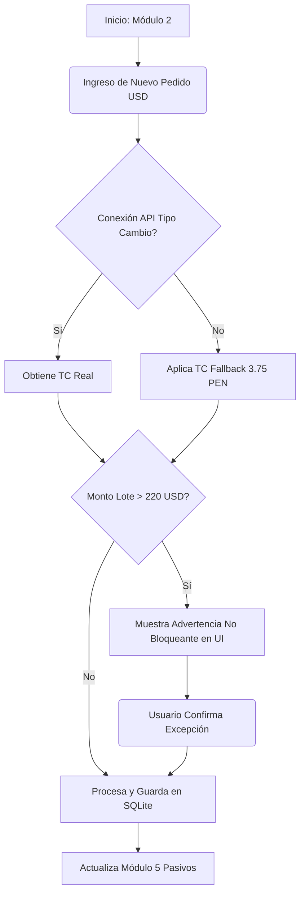

La arquitectura consolida la gestión operativa bimonetaria en seis módulos lógicos para una aplicación de escritorio basada en Wails, React y SQLite, diseñada bajo un modelo *offline-first* para un único usuario. Esta estructura garantiza alta cohesión técnica y reduce la carga cognitiva al agrupar funciones según su ciclo de vida comercial.

## 1. Dashboard Financiero (Inicio)

Consolida la analítica visual del negocio a través del cálculo de utilidad neta en moneda nacional.

* **Funcionalidades Core:**
* Muestra las ventas efectivamente cobradas en el mes.

* Aplica algoritmos de costos reales en Soles (PEN) a cada producto vendido.

* Genera el cálculo de ganancia neta total consolidada mediante gráficos dinámicos.

* **Componentes UI:** Cards de resumen financiero superior, Gráficos de barras (Recharts/Chart.js) y Badges de estado mensual.
* **Flujo E2E:** Usuario inicia la aplicación -> React consulta asíncronamente a SQLite -> Motor Go calcula la fórmula financiera integrando costo del producto en USD, tipo de cambio, factor de costo logístico y precio de venta en Soles -> UI renderiza gráficos sin bloqueo interactivo.

## 2. Compras e Importaciones

Administra el alta de catálogo y agrupaciones aduaneras de obligaciones en dólares.

* **Funcionalidades Core:**
* Registro de pedidos generales (stock) o de cliente (a pedido).

* Agrupación en Lotes de Importación y monitoreo del tope aduanero de $220 USD.

* Uso de Tipo de Cambio de Respaldo ante desconexión o fallo de API.

* Anulación de productos fallados con emisión de reintegros sin alterar liquidaciones pasadas.

* **Componentes UI Principales:**
* **Drawer:** Filtros avanzados por Lote, Rango de fechas o Tarjeta de crédito.
* **Dialogs:** Modal de Nuevo Pedido y Modal de Agrupación de Lotes. Alerta crítica (Toast/Dialog) si el lote alcanza los $220.01 USD.

* **Otros:** Data Table con paginación, indicador de estado de conexión para modo contingencia.

| Campo / Nombre | Componente UI | Clasificación / Validación |
| --- | --- | --- |
| Nombre / Descripción | Input Text | Obligatorio fiscalmente (Ley Comprobantes SUNAT).

 |
| Unidad de Medida | Select (Read-only) | Obligatorio, asignado automáticamente como "Unidad".

 |
| Costo (USD) | Input Number | Obligatorio para registro y cálculo de costo real.

 |
| Tipo de Pedido | Radio Button | Obligatorio (General o Cliente).

 |
| Tarjeta de Pago | Select | Obligatorio para trazabilidad de pasivos.

 |
| Lote de Importación | Autocomplete | Opcional individualmente, necesario para control de $220 USD.

 |

* **Flujo E2E:** Click en "Nuevo Pedido" -> Apertura de Dialog -> Ingreso de datos y selección de Tipo de Cambio (aplica *fallback* de 3.75 PEN si falla la API) -> Si el lote supera $220 USD, el sistema advierte pero permite guardar con confirmación explícita -> Cierre de Dialog y Toast de éxito.

## 3. Inventario y Almacén

Controla el ingreso físico al Kardex y las reglas de obsolescencia de inventario.

* **Funcionalidades Core:**
* Enrutamiento e incremento de stock en el almacén principal al marcar como "Recibida" una orden.

* Cálculo de antigüedad desde fecha de recepción y generación de alertas visuales de remate.

* Manejo de desfase del reloj (*clock skew*) almacenando fechas en ISO-8601/UTC estricto.

* Bloqueo local de ajustes de stock a valores negativos o cero ($>0$).

* **Componentes UI Principales:**
* **Drawer:** Botón/Filtro rápido "Ver productos en Remate".

* **Dialogs:** Modal de Recepción de Mercadería y Modal de Ajuste Manual.
* **Otros:** Badges dinámicos (Stock Normal / Remate).

| Campo / Nombre | Componente UI | Clasificación / Validación |
| --- | --- | --- |
| Pedido Asociado | Select (Disabled) | Obligatorio para trazabilidad en el Kardex.

 |
| Almacén Destino | Select (Disabled) | Obligatorio, preseleccionado como Almacén Principal.

 |
| Fecha Ingreso | DatePicker | Obligatorio, base para cómputo de regla de permanencia.

 |
| Cantidad | Input Number | Obligatorio, validado como entero positivo ($>0$) en React.

 |

* **Flujo E2E:** En tabla de importaciones, click en "Marcar Recibido" -> Se abre Dialog cargando fecha actual del sistema validada -> Usuario confirma cantidad -> El motor recalcula de inmediato etiquetas de "Remate" sobre el catálogo sin reiniciar la app.

## 4. Ventas Locales y Facturación (PEN)

Centraliza la salida de mercadería en moneda local y gestión de cartera de clientes.

* **Funcionalidades Core:**
* Registro de ventas al contado o al crédito.

* Validación Regex local de identificadores fiscales (DNI 8 dígitos / RUC 11 dígitos con prefijo 10 o 20) impidiendo guardados inválidos ante SUNAT.

* Control restrictivo donde la fecha de vencimiento debe ser igual o posterior a la emisión.

* Alerta de quiebre de stock impidiendo pedidos generales con stock 0, pero permitiendo transacciones de "Pedido de Cliente".

* **Componentes UI Principales:**
* **Drawer:** Historial de cobros y facturas pendientes.
* **Dialogs:** Modal de Nuevo Cliente.
* **Otros:** Stepper UI para el flujo de caja (1. Cliente -> 2. Carrito -> 3. Pago).

| Campo / Nombre | Componente UI | Clasificación / Validación |
| --- | --- | --- |
| Cliente (Identificador) | Autocomplete / Input | Obligatorio fiscalmente (DNI/RUC válido).

 |
| Moneda | Select (Disabled) | Obligatorio, bloqueado en PEN (Soles).

 |
| Monto (PEN) | Input Number | Obligatorio.

 |
| Fecha Emisión | DatePicker | Obligatorio para devengado de impuestos.

 |
| Fecha Vencimiento | DatePicker | Obligatorio en ventas a crédito, debe ser $\ge$ fecha emisión.

 |
| Notas | Textarea | Opcional libre.

 |

* **Flujo E2E:** Usuario inicia "Nueva Venta" general sobre ítem sin stock -> Alerta bloqueante inmediata -> Cambia a "Pedido de Cliente" permitiendo avanzar -> Selecciona crédito y fija fecha de vencimiento -> Validación estricta aprueba formulario -> Persistencia en SQLite -> Toast notificación.

## 5. Tesorería y Pasivos Internacionales

Proyecta deudas en USD agrupadas en ciclos financieros de crédito.

* **Funcionalidades Core:**
* Agrupación de obligaciones en ciclos de facturación.

* Ajuste automático de fechas de corte a final de mes durante meses cortos (febrero o meses de 30 días) para evitar saltos.

* Liquidación total del ciclo reiniciando saldo a $0.00.

* Borrado lógico (*soft delete*) de tarjetas para preservar el historial si tienen operaciones asociadas.

* **Componentes UI Principales:**
* **Drawer:** Filtro de ciclos liquidados vs. pendientes.
* **Dialogs:** Modal "Registrar Pago" (Confirmación) y Modal "Nueva Tarjeta".

| Campo / Nombre | Componente UI | Clasificación / Validación |
| --- | --- | --- |
| Banco / Entidad | Input Text | Obligatorio.

 |
| Últimos 4 dígitos | Input Number | Obligatorio.

 |
| Día de Corte | Select (1-31) | Obligatorio. Algoritmo Go ajusta en días 29/30/31.

 |
| Día de Pago | Select (1-31) | Obligatorio para proyectar límite de cancelación.

 |
| Límite Crédito (USD) | Input Number | Obligatorio.

 |

* **Flujo E2E:** Click en "Eliminar Tarjeta" en vista principal -> El sistema verifica en SQLite la existencia de operaciones históricas -> Diálogo de advertencia pide confirmación -> Go ejecuta un *soft delete* marcando tarjeta como inactiva sin dañar proyecciones -> Retorno a vista de catálogo.

## 6. Configuración General y Sistema

Administración central de reglas de negocio, respaldos locales y sincronización remota opcional.

* **Funcionalidades Core:**
* Ajuste de límites de remate, factor de costo de importación predeterminado (+0.07 USD) y TC de respaldo (3.75 PEN).

* Activación de clave local o generación de Token de Recuperación en instalación.

* Respaldo automático o manual capturando excepciones I/O de rutas inaccesibles con derivación a directorio interno de emergencia.

* Conmutador global para sincronización atómica Postgres en segundo plano (manteniendo a SQLite como fuente principal ante conflictos).

* **Componentes UI Principales:** Menú lateral de pestañas (Negocio, Autenticación, Respaldos, Sincronización, Apariencia). Switch/Toggles integrados y un *Directory Picker* nativo de SO.

| Campo / Nombre | Componente UI | Clasificación / Validación |
| --- | --- | --- |
| Días para Remate | Input Number | Obligatorio.

 |
| Costo Importación | Input Number | Obligatorio, factor decimal (+USD) sumado a compras.

 |
| TC de Respaldo | Input Number | Obligatorio, predeterminado 3.75.

 |
| Estado Contraseña | Switch | Obligatorio (Habilitado/Deshabilitado).

 |
| Ruta de Backup | Directory Picker | Obligatorio, diálogo nativo OS genera archivo estampa temporal.

 |
| Sincronización Nube | Switch | Obligatorio (Activado/Desactivado).

 |
| Tema Visual | Select / Switch | Obligatorio, modos Claro/Oscuro/Sistema.

 |

* **Flujo E2E:** Usuario programa backup en memoria USB y la desconecta -> Go intenta ejecutar rutina y captura error I/O -> Genera copia *fallback* en `AppData` u `Home` -> Notifica al usuario en React con Toast rojo de advertencia pero confirmando resguardo de emergencia.

